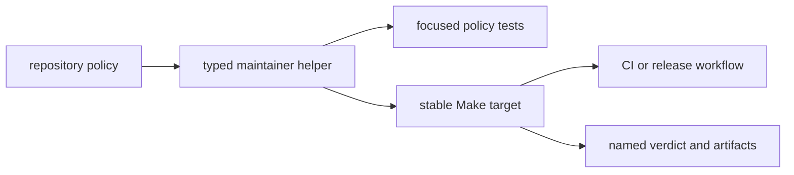

# Maintainer toolkit package

`bijux-proteomics-dev` is the tested implementation layer for repository
governance. It turns rules about documentation, package boundaries, contracts,
artifacts, dependencies, security, and release readiness into named Python
checks that local Make targets and CI workflows can share.

The package is not installed as part of a scientific or runtime deployment. It
exists for contributors, reviewers, CI, and release operators working on the
monorepo.

## Owned capabilities

| Capability | Source family | Typical root entrypoint |
| --- | --- | --- |
| documentation links, consistency, architecture, badges, and debt | `docs/` | `quality-docs-links`, `quality-docs-consistency`, `architecture-check`, `check-badges` |
| API freeze and contract drift | `governance/contracts/` | `api-freeze`, `openapi-drift`, `quality-public-api-types` |
| package ownership and topology | `governance/` | architecture and package-tree quality targets |
| dependency, artifact, benchmark, and graph quality | `quality/` | repository `quality` post-gates |
| dependency audit and trusted subprocess execution | `security/` | `security`, `security-dependency-allowlist` |
| versioning, licensing, publication, and hostile review | `release/` | `release-preflight` and publication targets |
| managed examples and models | `tools/` | `manage_examples`, `manage_models` |
| generated-output placement | `workspace/` | repository environment and artifact setup |

## What belongs elsewhere

Scientific calculations and contracts belong to Core. Execution and replay
belong to Runtime. Evidence, advisory, and laboratory behavior belong to their
canonical product packages. Make files own command composition, while GitHub
workflows own event and permission context.

A maintainer helper may inspect product packages and enforce cross-package
policy. It must not become a hidden implementation of product behavior or a
second source of scientific truth.

## Invocation model

Prefer documented root Make targets over direct module execution. Root targets
prepare the shared check environment, set repository paths, and keep local and
CI behavior aligned. Direct `python -m bijux_proteomics_dev...` execution is
appropriate when developing the helper itself and should use the same inputs
as its Make wrapper.

Every gate must have a clear policy statement, deterministic inputs, actionable
failure output, tests for pass and fail paths, and a stable caller. A gate that
only says “repository invalid” has not made governance reviewable.
