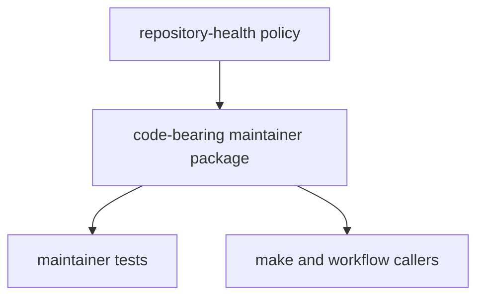

# Package Overview

`bijux-proteomics-dev` exists so repository-health behavior is reviewable in code instead of being hidden inside workflow YAML and shell fragments.

## Package Model

This page should give the shortest honest reason for the package to exist: repository policy is more reviewable when it lives in tested code instead of being smeared across YAML and shell entrypoints.

## What It Owns

- documentation checks and sync helpers under `docs/`
- contract-freeze and API drift helpers under `api/`
- release, security, and quality gates under `release/`, `security/`, and `quality/`
- maintainer tools and trusted-process helpers under `tools/` and `trusted_process.py`

## First Proof Check

- `packages/bijux-proteomics-dev/src/bijux_proteomics_dev/`
- `packages/bijux-proteomics-dev/tests`

## Design Pressure

The easy failure is to treat the maintainer package as a convenience bundle instead of the explicit code owner for repository-health rules.
