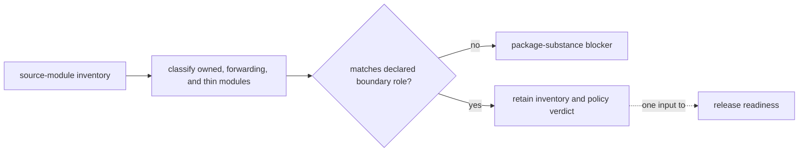

# Package substance

Package-substance evidence tests whether each distribution has a coherent reason to exist. Canonical products must own domain behavior, Foundation must remain a narrow shared kernel, Agentic Proteins must remain a forwarding bridge, and maintainer tooling must own real repository-policy checks. Counts expose structural pressure; they do not measure scientific quality or release readiness by themselves.



## Read the metrics

| Metric | Meaning | It does not prove |
| --- | --- | --- |
| source modules | Python modules classified in the package source tree | that every module is public or scientifically important |
| owned logic | modules with substantive behavior assigned to this package | correctness, transfer, or sufficient test evidence |
| forwarders | modules that intentionally route to another canonical owner | parity for every caller or safe retirement |
| thin modules | small modules that may be valid seams or may indicate fragmented ownership | architectural debt without reviewing the named module |
| all diagnostic thresholds | owned-logic and thin-module counts are inside the inventory thresholds | whole-repository readiness; some diagnostic pressure is not release-blocking for every boundary role |

## Current boundary inventory

| Package | Boundary role | Source modules | Owned logic | Forwarders | Thin modules | All diagnostic thresholds |
| --- | --- | ---: | ---: | ---: | ---: | --- |
| `agentic-proteins` | `compatibility_bridge` | 120 | 0 | 112 | 0 | yes |
| `bijux-proteomics-core` | `canonical_product` | 1337 | 1204 | 0 | 133 | no |
| `bijux-proteomics-dev` | `maintainer_support` | 188 | 160 | 0 | 28 | no |
| `bijux-proteomics-foundation` | `shared_kernel` | 39 | 37 | 0 | 2 | yes |
| `bijux-proteomics-intelligence` | `canonical_product` | 80 | 33 | 0 | 2 | yes |
| `bijux-proteomics-knowledge` | `canonical_product` | 76 | 54 | 0 | 22 | yes |
| `bijux-proteomics-lab` | `canonical_product` | 39 | 29 | 0 | 10 | yes |
| `bijux-proteomics-runtime` | `canonical_product` | 189 | 155 | 0 | 34 | yes |

The inventory contains 5 canonical products, 1 shared kernel, 1 compatibility bridge, and 1 maintainer support package.

## Interpret the verdict

- A canonical product is blocked when its release identity outruns its owned domain behavior or hides unresolved ownership.
- Foundation is blocked when shared infrastructure grows into scientific, execution, evidence, decision, or presentation policy.
- Agentic Proteins may be forwarding-heavy because compatibility is its declared role; bridge-owned product logic is still a blocker.
- Maintainer tooling must contain tested policy behavior rather than only shell entrypoints or empty package structure.
- Thin-module counts trigger review pressure. A thin module is acceptable when it protects a durable seam and suspect when it fragments one owner.

The current inventory reports **1 package-substance policy finding**. A clean substance verdict closes only this structural gate; scientific evidence, runtime replay, security, documentation, and release governance remain independent.

## Reproduce the evidence

The machine-readable inventory is retained at `docs/08-bijux-proteomics-maintain/bijux-proteomics-dev/package-substance.csv`. The policy and freshness checks live in `packages/bijux-proteomics-dev/tests/quality/architecture/test_package_substance.py`.

```bash
.venv/bin/python -m bijux_proteomics_dev.quality.architecture.package_substance --check
```

A stale report, role mismatch, or unresolved policy finding is evidence to repair the owning package boundary. It must not be silenced by changing the generated summary or lowering the threshold without an architectural decision.
