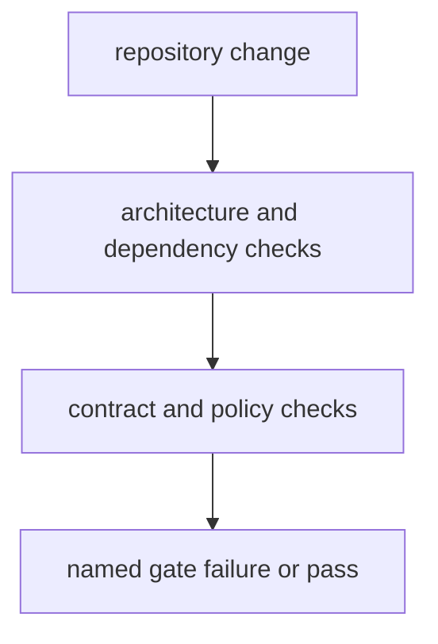

# Quality Gates

Quality gates in this package should block repository drift before it reaches release or public docs.

## Gate Model

This page should show quality gates as early drift detectors. A good gate names exactly which repository rule failed before the change reaches release or published docs.

## Gate Rules

- keep architecture, dependency, and contract checks explicit
- prefer failing with a named policy reason over silent lenience
- make every gate traceable to checked-in helper code and tests

## First Proof Check

- `src/bijux_proteomics_dev/quality/`
- `packages/bijux-proteomics-dev/tests`

## Design Pressure

The common failure is to let quality gates report generic breakage, which forces maintainers to rediscover which policy was supposed to be enforced.
