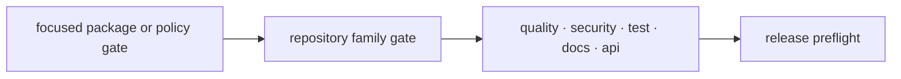

# Quality gates

Quality gates turn repository invariants into deterministic pass or fail
decisions. Each failure names the violated contract and enough evidence to route
the correction to its owner. Gates do not rewrite source, relax policy, or hide
known debt to manufacture a green result.

## Gate families

| Family | Examples | Protects |
| --- | --- | --- |
| package quality | Vulture, Deptry, Mypy, Interrogate | dead code, dependency hygiene, typing, documentation coverage |
| documentation | links, consistency, architecture docs, design debt | published navigation and source-backed claims |
| architecture | runtime boundaries, circular imports, canonical package tree | package ownership and dependency direction |
| contracts | API freeze, OpenAPI drift, public API types | machine-readable and import-facing compatibility |
| artifacts | root hygiene, file ownership, generated markers | governed storage and reproducible outputs |
| release | migration ledger, collection gate, release preflight | coordinated package-family readiness |
| security | Bandit, dependency audit, allowlist | source and dependency security posture |



## Run from narrow to broad

During development, run the closest package or named policy target. Before
handoff, run the public repository gate that includes it. Examples:

```bash
make quality PACKAGE=bijux-proteomics-knowledge
make quality-docs-links
make quality-artifact-governance
make quality-runtime-migration-validation
make quality
```

The root `quality` dispatcher runs package quality and then repository-level
post-gates. `make check` is broader: it includes lock, lint, collection, tests,
quality, security, docs, APIs, builds, and SBOMs.

## Failure contract

A gate failure reports the failing object, policy, and remediation direction.
Composite dispatch continues across packages where possible and reports the
complete failing package set. A check that cannot run because its environment
or governed input is missing fails explicitly rather than treating absence as
success.

Known failures remain failures. Record them in the handoff with exact paths and
diagnostics; do not add ignores, broaden exclusions, lower thresholds, or skip
the gate unless the underlying policy intentionally changes through review.

## Adding a gate

Add a gate only when the invariant is durable, automatable, and owned. Implement
the narrow helper, test pass and failure cases, expose a named Make target, wire
it into the appropriate composite layer, and document its inputs and verdict.
Avoid duplicating a rule already enforced by package tooling or shared
standards.
