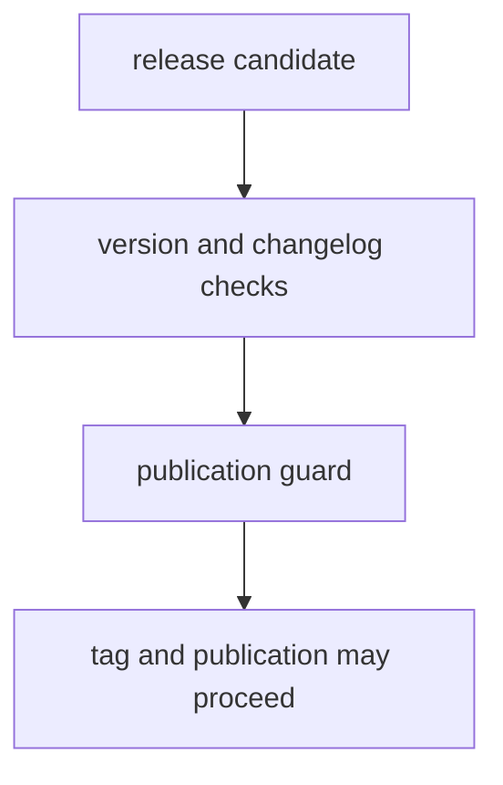

# Release Support

Release support should make version and publication rules visible before tags and workflows do the irreversible part.

## Release Model

This page should make release support feel like a pre-publication proof chain. The repository needs version logic, changelog discipline, and publication guards to agree before tags turn policy mistakes into published artifacts.

## Support Rules

- keep version resolution and changelog checks explicit
- block publication when repository proof is incomplete
- tie release decisions back to checked-in policy helpers
- require SSOT ownership readiness before any benchmark-backed scientific release claim can count as publishable
- require one checked-in scientific release dossier that names the owner,
  benchmark, tests, docs, and scientific limit for each workflow family

## First Proof Check

- `src/bijux_proteomics_dev/release/versioning/version_resolver.py`
- `src/bijux_proteomics_dev/release/governance/publication_guard.py`
- `src/bijux_proteomics_dev/release/governance/repository_truth.py`
- `src/bijux_proteomics_dev/release/governance/workflow_lab_consequence.py`
- `src/bijux_proteomics_dev/release/governance/workflow_consequence_chain.py`
- `src/bijux_proteomics_dev/release/governance/workflow_consequence_docs.py`
- `src/bijux_proteomics_dev/release/governance/workflow_public_scrutiny.py`
- `src/bijux_proteomics_dev/release/governance/hostile_review_pages.py`
- `src/bijux_proteomics_dev/release/governance/release_narrowing_protocol.py`
- `src/bijux_proteomics_dev/release/governance/final_preflight.py`
- `src/bijux_proteomics_dev/release/governance/scientific_readiness.py`
- `src/bijux_proteomics_dev/release/governance/generated_governance_freshness.py`
- `packages/bijux-proteomics-runtime/src/bijux_proteomics_runtime/workflows/black_box_reproducibility.py`
- `src/bijux_proteomics_dev/release/governance/ssot_readiness.py`
- `configs/package-governance/flagship-workflow-manifest.toml`
- `configs/package-governance/scientific-release-workflows.toml`

## Scientific Proof Chain

The release dossier is intentionally narrow. It covers the benchmark-backed
workflow families that the suite can defend today:

- `dda`
- `dia`
- `ptm`
- `lfq`
- `multiplex`
- `targeted`

Outsider-auditable workflow families today: `dda`, `dia`, `ptm`, `targeted`.
Review-grade-bounded workflow families today: `lfq`.
Internal-support-only workflow families today: `multiplex`.

For the strongest current outsider-readable proof, start with the DDA package
before reading the release policy helpers:

- `packages/bijux-proteomics-core/benchmark-assets/flagship-public-packages/dda_reviewable_run/README.md`
- `packages/bijux-proteomics-core/benchmark-assets/flagship-public-packages/dda_reviewable_run/package_manifest.json`
- `packages/bijux-proteomics-core/benchmark-assets/flagship-public-packages/dda_reviewable_run/scientific_invariants.json`
- `packages/bijux-proteomics-core/benchmark-assets/flagship-public-packages/dda_reviewable_run/warning_demonstrations.json`
- `packages/bijux-proteomics-runtime/src/bijux_proteomics_runtime/workflows/benchmark_runs.py`
- `packages/bijux-proteomics-knowledge/src/bijux_proteomics_knowledge/references/workflows/comparator_confrontations.py`

Reviewers should be able to open one manifest and see:

- the owning package
- the benchmark id and checked-in dataset locator
- the builder symbol that produces the reviewable output
- the test path that proves the path
- the doc path that explains the scope
- the exact scientific limit summary that keeps the claim honest

For `dda`, the release conversation should now point directly to:

- `benchmark:dda_search_reproducibility`
- `benchmark_package:dda_reviewable_run`
- `dda-maxquant-pipeline-corpus`
- `comparator_path:msfragger_imported_dda_review`
- `docs/01-bijux-proteomics/foundation/flagship-release-candidate.md`
- `docs/01-bijux-proteomics/foundation/elite-readiness-scorecard.md`

Use `build_scientific_release_dossier()` when you need the live code-backed
index, and review
`configs/package-governance/scientific-release-workflows.toml` when you need
the checked-in declaration that release policy depends on.

Use `build_repository_truth_report()` when the question is stronger than
package publication and benchmark scope: it answers whether the repository may
honestly speak in `reference-grade` or `elite` language at all.

That repository truth now includes the runtime flagship rerun gate. If the
strongest current runtime lane for a workflow family still depends on a fake
helper anywhere in its claimed flagship path, or the rerun ledger still names
an explicit faithful-rerun refusal, the family must not count toward
outsider-auditable or release-candidate authority.

That repository truth also includes the lab-consequence gate. A workflow family
must not be called lab-consequential unless the authority surface points to one
shipped requested-versus-observed outcome dossier and one assay-worth-it ledger
row for that same family.

That consequence realism now also depends on one shared consequence chain
across knowledge, intelligence, and lab. If those owners disagree on the
current strongest allowed posture, or if the shared consequence docs drift from
the live package surfaces, stronger recommendation language must stop.

Repository truth should not be cited without those shared consequence surfaces.
Its evidence path now includes:

- `docs/decision-support/workflow-consequence-maps.md`
- `docs/decision-support/what-changed-the-recommendation.md`
- `docs/lab-consequence/outcome-learning-loops.md`
- `docs/lab-consequence/workflow-refusal-handbook.md`

Open these consequence routes before widening recommendation or assay-facing
language:

- `docs/decision-support/workflow-consequence-maps.md`
- `docs/decision-support/what-changed-the-recommendation.md`
- `docs/lab-consequence/outcome-learning-loops.md`
- `docs/lab-consequence/workflow-refusal-handbook.md`

When the question is specifically how a runtime lane should be reopened,
challenged, or refused, open these runtime-owned boundary surfaces before
generalizing from runtime success:

- `docs/09-bijux-proteomics-runtime/runtime-execution-boundary.md`
- `docs/09-bijux-proteomics-runtime/black-box-run-verification.md`
- `docs/09-bijux-proteomics-runtime/raw-versus-import-execution.md`
- `docs/09-bijux-proteomics-runtime/runtime-rerun-refusals.md`

Those pages should not be the first stop for workflow trust. First open the
flagship package, runtime lane, comparator surface, and validating tests. Then
use repository truth to decide how far the repository may generalize from those
artifacts.

The current repository-wide language boundary is stricter than the strongest
current outsider packet:

- five bounded outsider-auditable workflow families exist
- multiplex remains internal support only
- repository-wide elite language is still blocked
- the scorecard for that boundary lives in
  `docs/01-bijux-proteomics/foundation/elite-readiness-scorecard.md`
- the workflow-family limit pages now live in
  `docs/01-bijux-proteomics/foundation/workflow-claim-limits.md` and
  `docs/01-bijux-proteomics/foundation/why-multiplex-stops-at-internal-support.md`
- the artifact-role coherence map for that boundary now lives in
  `docs/01-bijux-proteomics/foundation/public-artifact-role-matrix.md`
- the public opening-order registry now lives in
  `docs/01-bijux-proteomics/foundation/public-artifact-index.md`

Use `validate_generated_governance_freshness()` before release to make sure
the generated governance reports under `configs/package-governance/` are still
fresh instead of silently stale.

Use `validate_public_language()` when the question is whether root docs,
package READMEs, foundation pages, and release-support surfaces have slipped
back into retired public language after the last cleanup.

Use `validate_workflow_public_scrutiny()` when the question is whether the
external review kits, artifact index, artifact-role matrix, and stronger
release language are still aligned.

Use `validate_workflow_consequence_coherence()` when the question is whether
knowledge contradiction pressure, intelligence recommendation posture, and lab
consequence still agree on the same strongest allowed family sentence.

Use `bijux_proteomics_dev.release.governance.hostile_review_pages` when the
question is whether the repository-wide hostile review kit and the blocker
pages are still generated from live release evidence instead of hand-softened
prose.

Use `bijux_proteomics_dev.release.governance.release_narrowing_protocol` when
the question is whether workflow-family language should already be narrower
than the strongest public sentence.

Use `make release-preflight` when the question is whether the minimum hostile
review gates across docs, package boundaries, benchmark assets, runtime
reproducibility, consequence coherence, and artifact hygiene still survive in
one exact order.

Use `validate_ssot_readiness()` when the question is whether public symbol
ownership, duplicate model ownership, compatibility-bridge posture, and
package-boundary substance are all clean enough for scientific release claims
to count at all. Review
`docs/08-bijux-proteomics-maintain/bijux-proteomics-dev/package-substance.md`
when the question is whether the current package split still earns its
separate release identities.

## Design Pressure

The easy failure is to let release automation look authoritative even when the underlying version and publication rules are no longer explicit or aligned.
