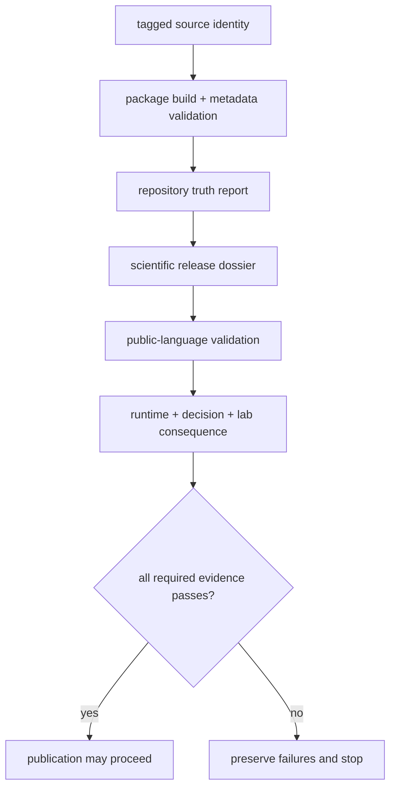

# Release Support

Release support binds a source identity, publishable distributions, scientific
evidence, public language, and refusal state into one review. A build proves
that archives can be produced. It does not prove that package boundaries are
coherent, generated governance is current, a workflow can be rerun, or a
scientific claim is ready for publication.

## Release Evidence Pipeline

`make release-preflight` evaluates documentation clarity, package boundaries,
test collection, benchmark assets, runtime reproducibility, consequence
coherence, and artifact hygiene in a fixed order. Every stage reports its own
failures; a later pass cannot erase an earlier refusal.

## Scientific Release Dossier

`build_scientific_release_dossier()` in
`release/governance/scientific_readiness.py` resolves each declared workflow
from `configs/package-governance/scientific-release-workflows.toml`. The related
`configs/package-governance/flagship-workflow-manifest.toml` records flagship
workflow ownership and evidence paths.

For `dda`, `dia`, `lfq`, `multiplex`, `ptm`, and `targeted`, the dossier binds:

- owning package and workflow identifier;
- dataset or public benchmark-package locator;
- builder symbol and package test evidence;
- public documentation and claim-limit route;
- scientific limitation that prevents broader wording.

The DDA evidence chain begins at
`benchmark-assets/flagship-public-packages/dda_reviewable_run/package_manifest.json`,
identifies the `dda-maxquant-pipeline-corpus`, and records
`comparator_path:msfragger_imported_dda_review`. Those identifiers make the
comparison inspectable; they do not turn imported search results into native
engine execution.

## Repository Truth

`build_repository_truth_report()` composes evidence from package ownership,
public APIs, benchmarks, Runtime, generated governance, and package substance.
It depends on these validators rather than replacing them:

| Validator | Release question |
| --- | --- |
| `validate_ssot_readiness()` | do structured models and public symbols have coherent canonical owners? |
| `validate_generated_governance_freshness()` | do checked governance records match their generators and inputs? |
| `validate_public_language()` | does wording stay within the allowed evidence posture? |
| `validate_workflow_consequence_coherence()` | do grounding, recommendation, and Lab consequence agree across families? |
| `validate_workflow_public_scrutiny()` | can an external reviewer reach the artifacts that support or block each claim? |

Repository truth should not be cited without those shared consequence surfaces.
Open `workflow-consequence-maps.md`, `what-changed-the-recommendation.md`,
`outcome-learning-loops.md`, and `workflow-refusal-handbook.md` with the report.

## Runtime And Consequence Gates

Runtime black-box evidence is implemented in
`bijux_proteomics_runtime/workflows/black_box_reproducibility.py` and reviewed
through:

- `runtime-execution-boundary.md` for exact manifests and entrypoints;
- `black-box-run-verification.md` for installed public behavior;
- `raw-versus-import-execution.md` for native and imported custody;
- `runtime-rerun-refusals.md` for evidence required to widen a rerun claim.

The runtime flagship rerun gate answers whether the declared lane can be
reopened under its recorded environment and artifact contract. The
lab-consequence gate answers whether an advisory result has a controlled,
feasible, and informative downstream path. Neither gate substitutes for Core
scientific acceptance.

## Public Scrutiny Routes

Review the following pages before using repository-wide readiness language:

- `flagship-release-candidate.md` for the candidate bundle and current vetoes;
- `elite-readiness-scorecard.md` for family evidence completeness;
- `workflow-claim-limits.md` for allowed and blocked family language;
- `why-multiplex-stops-at-internal-support.md` for the multiplex boundary;
- `public-artifact-index.md` for externally inspectable evidence;
- `public-artifact-role-matrix.md` for artifact authority and non-authority;
- `package-substance.md` for thin-module and package-boundary pressure.

The generator modules `workflow_lab_consequence.py`,
`workflow_consequence_chain.py`, `workflow_consequence_docs.py`,
`workflow_public_scrutiny.py`, `hostile_review_pages.py`, and
`release_narrowing_protocol.py` keep the shared family and hostile-review
surfaces synchronized. `final_preflight.py` composes their results into the
ordered release decision. Fresh output is required, but freshness alone does
not mean the evidence passes.

## Publication Refusals

| Failure | Required response |
| --- | --- |
| unresolved release identity | stop; establish the source version and tag relationship |
| wheel or sdist version differs from source | reject the artifact and rebuild from the tagged revision |
| duplicate canonical ownership | resolve the owner; do not waive the SSOT gate |
| stale generated governance | correct the generator or input and regenerate |
| requested language exceeds allowed language | apply the release narrowing protocol |
| runtime lane cannot support the claimed rerun mode | preserve the refusal and narrow the claim |
| consequence chain is incomplete or contradictory | withhold repository-wide readiness language |
| package-root artifacts or caches remain | clean the output and correct its producer |

Do not weaken a validator, hand-edit generated evidence, or discard failure
output to unblock publication. Resolve the owner-level cause, rerun the narrow
gate, and then repeat `make release-preflight` from a clean repository state.

## Release Decision Record

A release decision is reconstructable only when the record binds the following
fields to the same candidate:

| field | required evidence |
| --- | --- |
| source identity | commit, clean-worktree result, tag, and source version |
| distribution identity | wheel and sdist names, versions, hashes, metadata validation, and package inventory |
| validation identity | exact commands, environment, timestamps, results, and retained failure output |
| generated authority | generator inputs, checked outputs, and freshness results |
| scientific authority | workflow dossier, primary and companion benchmark identities, runtime mode, and acceptance result |
| public authority | requested and allowed language, consequence posture, and unresolved vetoes |
| publication action | published, withheld, or refused; reviewer; reason; and supersession link |

Passing results from different commits or environments cannot be assembled
into one release decision unless the record demonstrates that the candidate
inputs are identical. A rebuilt artifact receives new hashes and a new
distribution review even when its version string is unchanged.
