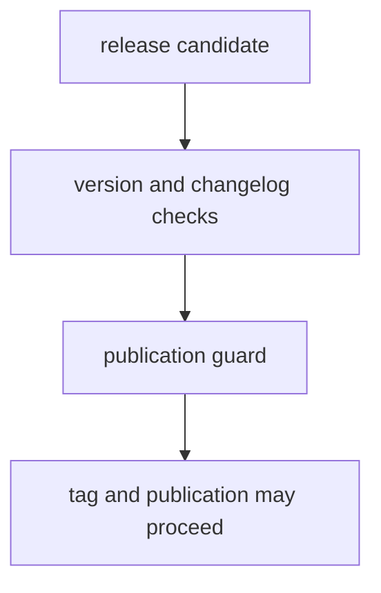

# Release Support

Release support should make version and publication rules visible before tags and workflows do the irreversible part.

## Release Model

This page should make release support feel like a pre-publication proof chain. The repository needs version logic, changelog discipline, and publication guards to agree before tags turn policy mistakes into published artifacts.

## Support Rules

- keep version resolution and changelog checks explicit
- block publication when repository proof is incomplete
- tie release decisions back to checked-in policy helpers

## First Proof Check

- `src/bijux_proteomics_dev/release/version_resolver.py`
- `src/bijux_proteomics_dev/release/changelog_version.py`
- `src/bijux_proteomics_dev/release/publication_guard.py`

## Design Pressure

The easy failure is to let release automation look authoritative even when the underlying version and publication rules are no longer explicit or aligned.
