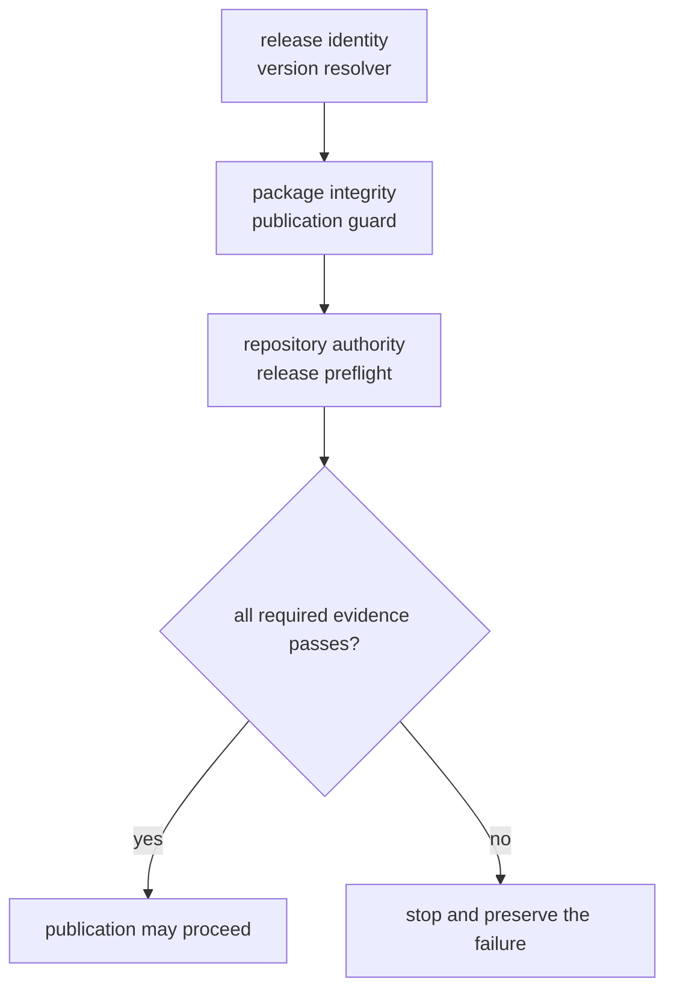

# Release Support

`bijux-proteomics-dev` turns release policy into executable evidence. Its release
modules answer three different questions: what version would be published,
whether the artifacts are mechanically publishable, and whether the repository
can defend the claims attached to that release.

## Three Proof Layers

### Release identity

`release/versioning/version_resolver.py` reads static project metadata when
present, otherwise asks Hatch for the VCS-derived version, and finally inspects
matching Git tags. An unresolved version becomes `0.0.0`; publication treats
that value as a failure rather than inventing an identity.

### Package integrity

`release/governance/publication_guard.py` rejects prerelease and local-version
markers by default. When given a distribution directory, it also parses wheel
and source-distribution filenames and requires every embedded version to equal
the resolved version. Twine then checks the resulting archive metadata.

### Repository authority

`release/governance/final_preflight.py` composes the minimum hostile-review
sequence behind `make release-preflight`:

1. documentation clarity;
2. package boundaries;
3. test collection;
4. benchmark assets;
5. runtime reproducibility;
6. consequence coherence;
7. artifact hygiene.

The report prints every failing stage and returns a nonzero status when any
stage fails. A downstream stage cannot erase an earlier failure.

## Scientific Release Dossier

The scientific release dossier connects a workflow-family claim to concrete
ownership and evidence. Its checked-in declaration is
`configs/package-governance/scientific-release-workflows.toml`. For each covered
family, a reviewer should be able to recover:

- the owning package and benchmark identifier;
- the checked-in dataset or benchmark-package locator;
- the builder symbol that creates the reviewable output;
- the test and documentation paths that defend it;
- the scientific limit that constrains public language.

Current proof is intentionally uneven. The checked-in claim-limit surfaces
request outsider-auditable authority for DDA, DIA, PTM, and targeted workflows,
review-grade-bounded authority for LFQ, and internal-support-only authority for
multiplex. The live release preflight is stricter: DDA currently stops at
review-grade bounded because its black-box benchmark dashboard does not defend
the requested outsider-auditable level. Until that disagreement is resolved,
the repository cannot publish at the declared claim limit.

The most developed review packet is the DDA reviewable run under
`packages/bijux-proteomics-core/benchmark-assets/flagship-public-packages/dda_reviewable_run/`,
but packet depth does not override the runtime rerun gate. No repository-wide
label may silently promote a workflow family beyond the weakest live authority
surface that evaluates it.

## Evidence Routes

Use the narrowest authority surface that answers the review question:

| Question | Authority |
| --- | --- |
| Is the version publishable? | `version_resolver.py` and `publication_guard.py` |
| Are generated governance records current? | `generated_governance_freshness.py` |
| Do package ownership and compatibility bridges remain coherent? | `ssot_readiness.py` |
| Is public wording no stronger than the evidence? | `public_language.py` and `release_narrowing_protocol.py` |
| Do runtime reruns and scientific claims agree? | `runtime_black_box_docs.py` and `scientific_readiness.py` |
| Can the repository pass its minimum release bar? | `final_preflight.py` |

Repository truth is a derived conclusion, not a substitute for opening the
underlying benchmark package, runtime lane, comparator result, validating test,
and claim-limit page. A release must narrow its language when any of those
surfaces disagree.

## Failure Contract

Release checks are refusal mechanisms. Do not regenerate evidence merely to make
a diff disappear, opt into prerelease flags accidentally, skip Twine validation,
or weaken public wording checks to unblock a tag. Resolve the owner-level cause,
rerun the narrow failing gate, and then rerun `make release-preflight` from a
clean repository state.
