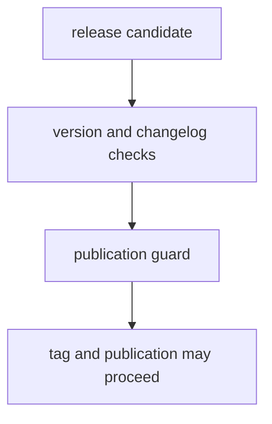

# Release Support

Release support should make version and publication rules visible before tags and workflows do the irreversible part.

## Release Model

This page should make release support feel like a pre-publication proof chain. The repository needs version logic, changelog discipline, and publication guards to agree before tags turn policy mistakes into published artifacts.

## Support Rules

- keep version resolution and changelog checks explicit
- block publication when repository proof is incomplete
- tie release decisions back to checked-in policy helpers
- require SSOT ownership readiness before any benchmark-backed scientific release claim can count as publishable
- require one checked-in scientific release dossier that names the owner,
  benchmark, tests, docs, and scientific limit for each workflow family

## First Proof Check

- `src/bijux_proteomics_dev/release/versioning/version_resolver.py`
- `src/bijux_proteomics_dev/release/versioning/changelog_version.py`
- `src/bijux_proteomics_dev/release/governance/publication_guard.py`
- `src/bijux_proteomics_dev/release/governance/repository_truth.py`
- `src/bijux_proteomics_dev/release/governance/scientific_readiness.py`
- `src/bijux_proteomics_dev/release/governance/generated_governance_freshness.py`
- `src/bijux_proteomics_dev/release/governance/ssot_readiness.py`
- `configs/package-governance/canonical-workflow-manifest.toml`
- `configs/package-governance/scientific-release-workflows.toml`

## Scientific Proof Chain

The release dossier is intentionally narrow. It covers the benchmark-backed
workflow families that the suite can defend today:

- `dda`
- `dia`
- `ptm`
- `lfq`
- `multiplex`
- `targeted`

For the strongest current outsider-readable proof, start with the DDA package
before reading the release policy helpers:

- `packages/bijux-proteomics-core/tests/fixtures/public_benchmark_packages/dda_reviewable_run/README.md`
- `packages/bijux-proteomics-core/tests/fixtures/public_benchmark_packages/dda_reviewable_run/package_manifest.json`
- `packages/bijux-proteomics-core/tests/fixtures/public_benchmark_packages/dda_reviewable_run/scientific_invariants.json`
- `packages/bijux-proteomics-core/tests/fixtures/public_benchmark_packages/dda_reviewable_run/warning_demonstrations.json`
- `packages/bijux-proteomics-runtime/src/bijux_proteomics_runtime/workflows/benchmark_runs.py`
- `packages/bijux-proteomics-knowledge/src/bijux_proteomics_knowledge/references/workflows/comparator_confrontations.py`

Reviewers should be able to open one manifest and see:

- the owning package
- the benchmark id and checked-in dataset locator
- the builder symbol that produces the reviewable output
- the test path that proves the path
- the doc path that explains the scope
- the exact scientific limit summary that keeps the claim honest

For `dda`, the release conversation should now point directly to:

- `benchmark:dda_search_reproducibility`
- `benchmark_package:dda_reviewable_run`
- `dda-maxquant-pipeline-corpus`
- `comparator_path:msfragger_imported_dda_review`

Use `build_scientific_release_dossier()` when you need the live code-backed
index, and review
`configs/package-governance/scientific-release-workflows.toml` when you need
the checked-in declaration that release policy depends on.

Use `build_repository_truth_report()` when the question is stronger than
package publication and benchmark scope: it answers whether the repository may
honestly speak in `reference-grade` or `elite` language at all.

That report should not be the first stop for workflow trust. First open the
flagship package, runtime lane, comparator surface, and validating tests. Then
use repository truth to decide how far the repository may generalize from those
artifacts.

Use `validate_generated_governance_freshness()` before release to make sure
the generated governance reports under `configs/package-governance/` are still
fresh instead of silently stale.

Use `validate_ssot_readiness()` when the question is whether public symbol
ownership, duplicate model ownership, compatibility-bridge posture, and
package-boundary substance are all clean enough for scientific release claims
to count at all. Review
`docs/08-bijux-proteomics-maintain/bijux-proteomics-dev/package-substance.md`
when the question is whether the current package split still earns its
separate release identities.

## Design Pressure

The easy failure is to let release automation look authoritative even when the underlying version and publication rules are no longer explicit or aligned.
