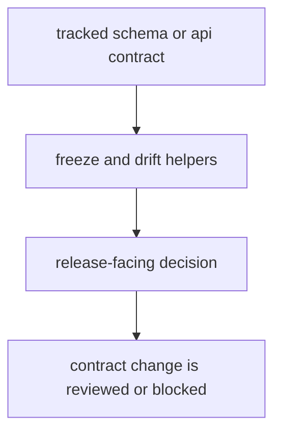

# Schema Governance

Schema governance in the maintainer package exists to keep public and frozen contracts stable across releases.

## Governance Model

This page should make schema governance feel like release governance for public contracts. The maintainer package is where contract drift becomes detectable before consumers discover it the hard way.

## Governance Rules

- freeze contracts deliberately and review drift explicitly
- connect API drift checks to release-facing decisions
- treat undocumented contract movement as a blocker

## First Proof Check

- `src/bijux_proteomics_dev/governance/freeze_contracts.py`
- `src/bijux_proteomics_dev/governance/openapi_drift.py`

## Design Pressure

The common drift is to treat frozen contracts as passive files instead of active release blockers when undocumented movement appears.
