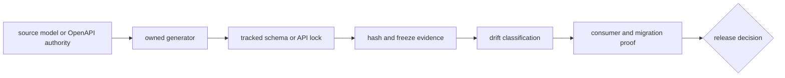

# Schema governance

Tracked schemas, API locks, hashes, and compatibility records are executable
release contracts. Drift is either an intentional versioned change with
consumer evidence or a release blocker.

## Contract flow

## Governed surfaces

| Surface | Owning check | Required review |
| --- | --- | --- |
| frozen API schema and hash | `make api-freeze` | source authority, generated diff, version, public consumer impact |
| OpenAPI source versus tracked contract | `make openapi-drift` | breaking/additive classification and version policy |
| cross-package function signatures | cross-package signature governance | import sites, parameter and return semantics, affected callers |
| serialization compatibility | package serialization compatibility checks | old/new fixtures, migration, rejection, provenance, round trip |
| public API typing targets | `make quality-public-api-types` | curated modules, mypy/pyright result, exported contract |

## Change classification

| Change | Examples | Required disposition |
| --- | --- | --- |
| compatible additive | optional field with stable default and reader behavior | regenerate, review bytes, test old/new consumers |
| behaviorally breaking | changed default, validation, enum, outcome, units, or error shape | version contract and provide migration or explicit rejection |
| structurally breaking | removed/renamed field, endpoint, parameter, or export | new version plus caller migration evidence |
| generated drift | tracked file differs without source change | repair generator path or regenerate from reviewed authority |
| stale hash | schema and checksum disagree | regenerate together; never patch hash alone |

## Safe contract change

1. Identify the authoritative source and affected consumers.
2. Change source models and focused tests.
3. Generate contracts through the owning command.
4. Inspect semantic and byte-level diffs separately.
5. Classify compatibility and add version or migration evidence.
6. Run freeze, drift, typing, serialization, and consumer checks implicated by
   the change.
7. Commit source and governed output together when inseparable for correctness.

Passing a freeze check means tracked output matches its authority. It does not
prove that an intentional new contract is backward compatible or scientifically
equivalent.
