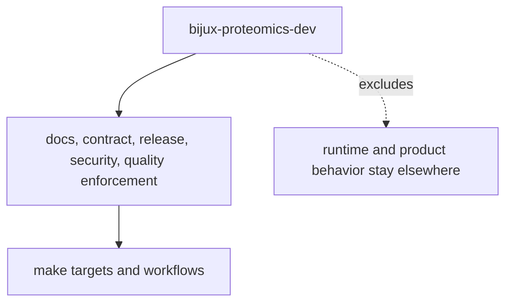

# Scope and Non-Goals

This package owns repository-health enforcement. It should stay narrow enough that product behavior still belongs to product packages.

## Scope Model

This page should help reviewers reject the easy mistake of putting product logic in a maintainer helper just because several workflows touch it.

## In Scope

- repository-wide docs, contract, release, security, and quality enforcement
- helper code that backs Make targets and workflow rules
- tooling that keeps checked-in policy easier to audit

## Out Of Scope

- runtime or product-package feature behavior
- user-facing domain semantics
- automation whose best home is a product package itself

## First Proof Check

- `src/bijux_proteomics_dev/`
- maintainer tests and workflow call sites

## Design Pressure

The easy failure is to give the maintainer package one small product responsibility at a time until it becomes a quiet second owner of product behavior.
