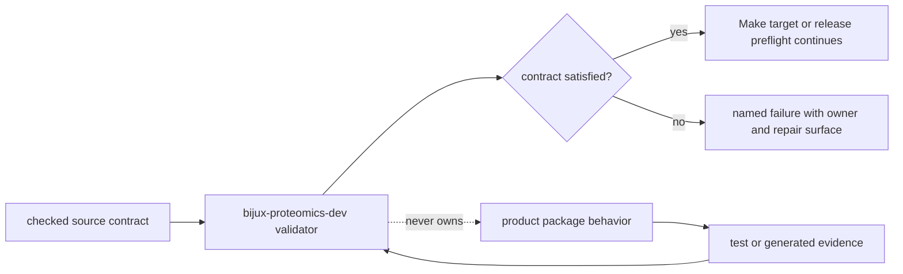

# Scope and non-goals

`bijux-proteomics-dev` is the repository's enforcement package. It turns
checked contracts into deterministic verdicts for documentation, architecture,
quality, release, security, and workspace hygiene. Product packages own what a
proteomics operation means; this package owns whether the repository can prove
that its declared boundaries and delivery rules still hold.

That distinction keeps a failed gate interpretable. A scientific mismatch
belongs to the package that computes the result. A missing manifest entry,
stale generated contract, broken documentation link, or unapproved root
dependency belongs here.



## Owned surfaces

The source tree is grouped by the kind of repository claim it enforces:

| Surface | Responsibility | Representative proof |
| --- | --- | --- |
| `docs/` | navigation, link, consistency, onboarding, and architecture-document checks | a public route resolves and its claimed source path exists |
| `governance/` | package shape, contracts, dependency boundaries, and checked ledgers | a declared owner matches the code and manifest graph |
| `quality/` | cross-package invariants and artifact, benchmark, graph, and import rules | an implementation change does not weaken a repository invariant |
| `release/` | preflight ordering, licensing, collection, and release-surface checks | a distributable can be traced through the required release evidence |
| `security/` | root dependency policy, audit-result interpretation, and trusted process execution | a security input produces a strict, reproducible verdict |
| `tools/` and `workspace/` | explicit maintainer operations and repository artifact placement | an operation writes to its governed destination |

The package may parse product-owned declarations and inspect product-owned
outputs. It does not acquire ownership of their scientific meaning by doing so.

## Boundary test

Place a new responsibility here only when all of these statements are true:

1. the rule applies to repository integrity or delivery rather than a single
   product's scientific behavior;
2. its authoritative input is a checked contract, source tree, or generated
   evidence surface;
3. its verdict is useful from a Make target, CI job, or release preflight;
4. it can report the violated rule and owning repair surface without guessing;
5. product packages do not need to import the maintainer package at runtime.

If a proposed helper computes peptide evidence, interprets spectra, ranks
proteins, constructs knowledge claims, or chooses execution providers, it
belongs in the corresponding product package even when CI is its first caller.

## Non-goals

`bijux-proteomics-dev` is not:

- a shared home for scientific algorithms that do not yet have a clear owner;
- a runtime dependency of public product packages;
- an alternate CLI or orchestration layer for user workflows;
- a store for secrets, private operational state, or unreviewed exceptions;
- a substitute for package-level tests, threat models, or domain validation;
- an authority that may rewrite source contracts merely to make a check pass.

The package also does not turn every convention into policy. A gate is warranted
when drift would create an ambiguous owner, an unreproducible claim, an unsafe
release, or a misleading public contract. Stylistic preference alone is not a
repository invariant.

## Dependency direction

Product packages must remain usable without `bijux-proteomics-dev`. The
maintainer package can inspect repository files and import narrowly scoped
interfaces for verification, but the dependency direction cannot reverse:

```text
repository contracts + product evidence -> bijux-proteomics-dev -> verdict
product runtime                         -X-> bijux-proteomics-dev
```

This one-way relationship is the practical guard against a quiet second
implementation layer. Review import changes together with the relevant package
dependency graph and reject any product-to-maintainer runtime edge.
