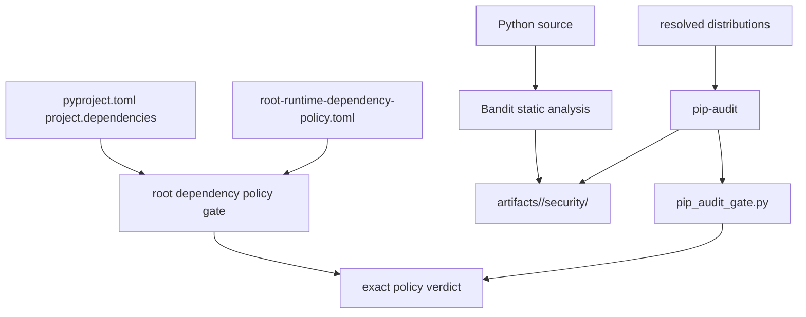

# Security gates

Repository security is checked through three distinct controls: static source
analysis, dependency vulnerability audit, and an exact root runtime-dependency
contract. They answer different questions and none substitutes for the others.



## Gate matrix

| Gate | Input | Pass condition | Evidence or diagnostic |
| --- | --- | --- | --- |
| Bandit | configured Python source paths | no unaccepted finding at the configured severity policy | JSON and text reports below the package security artifact directory |
| pip-audit | resolved dependency audit JSON | no vulnerability remains after explicit identifier and alias matching | `pip-audit.json`, `pip-audit.txt`, affected distribution, installed version, identifier, fix versions |
| root runtime dependency policy | root `[project].dependencies` and `configs/package-governance/root-runtime-dependency-policy.toml` | normalized declared and approved distribution sets are identical | missing approvals and stale policy entries are reported separately |

Run the repository-level policy directly with:

```bash
make security-dependency-allowlist
```

Package security targets compose Bandit and pip-audit through the shared Make
security contract. Their reports belong below `artifacts/`; report files are
run evidence, not reviewed security policy.

## Root runtime dependency contract

The root project is an orchestration workspace and currently ships no runtime
dependencies. Its test, development, provider, and optional tool sets live in
named dependency groups. The deny-by-default policy records that empty runtime
surface explicitly.

The gate performs an exact comparison rather than a one-sided allowlist check:

- a new root runtime dependency fails until policy review approves it;
- an approval with no corresponding declaration also fails, preventing stale
  permission from silently broadening future changes;
- a missing or malformed project file or policy file fails closed;
- distribution names are normalized before comparison, while version
  constraints remain owned by `pyproject.toml`.

The executable policy is TOML under `configs/package-governance/`. The public
handbook explains the contract and its consequence; it does not carry a list
that security code parses from prose.

## Vulnerability verdicts

`pip_audit_gate.py` accepts pip-audit's list form and its object form with a
`dependencies` list. For each vulnerability it considers the primary
identifier and aliases, so an explicit ignore cannot be bypassed merely by the
identifier that pip-audit chooses to display.

An ignore is a risk decision, not a parser convenience. Review the exact
identifier, aliases, affected version, available fix, exposure, and owner before
changing `SECURITY_IGNORE_IDS`. Keep the decision visible in the Make security
configuration and remove it when the accepted condition no longer applies.

Strict mode is the trust-bearing path:

| Condition | Strict result |
| --- | --- |
| report missing, invalid JSON, or unsupported shape | invocation/evidence failure |
| unignored vulnerability remains | security failure |
| valid report contains no remaining vulnerability | pass |

Non-strict mode supports local diagnosis but cannot establish release safety.
The console verdict always distinguishes ignored findings, remaining findings,
and unreadable evidence.

## Process boundary

Security automation that starts another program must use the trusted-process
boundary and an absolute executable path. This prevents repository-relative
files or a modified working directory from changing which executable is run.
The process call, report path, and strictness setting must remain explicit at
the calling edge.

## Interpreting a failure

Do not silence the first failing layer:

1. If the tool could not run or its report is unreadable, repair evidence
   production and rerun it.
2. If a source or vulnerability finding remains, fix or explicitly assess that
   finding; passing unit tests do not discharge it.
3. If dependency policy fails, review the root runtime declaration and policy
   together. Move development-only tooling to a dependency group rather than
   approving it as runtime.
4. Preserve the failing report under the governed artifact path when it is
   needed for review, but never commit it as a replacement for the policy.

A green security target means its named controls completed under the configured
strictness. It is not a complete product threat model, supply-chain attestation,
or guarantee that every transitive risk has been discovered.
