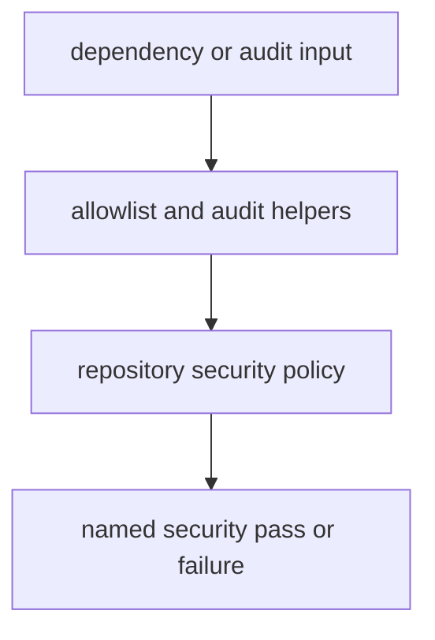

# Security Gates

Security gates here protect repository policy boundaries, not product-specific threat models.

## Security Model

This page should make security gates feel like reviewable policy code. The maintainer package is not trying to replace product threat modeling; it is trying to keep repository-level dependency and audit rules explicit.

## Gate Rules

- dependency allowlists and audit checks should stay reviewable in code
- security failures should point to the owning helper and policy surface
- do not hide repository risk behind passing product-package tests

## First Proof Check

- `src/bijux_proteomics_dev/security/dependency_allowlist.py`
- `src/bijux_proteomics_dev/security/pip_audit_gate.py`

## Design Pressure

The common drift is to hide repository risk behind passing product tests, even though dependency policy failures live at a different layer entirely.
