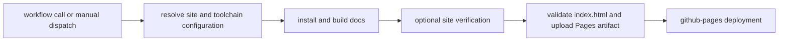

# Documentation deployment workflow

`.github/workflows/deploy-docs.yml` builds the public handbook and deploys a
validated Pages artifact. It is callable by another workflow or by manual
dispatch; it does not declare its own push trigger.

## Build and deployment boundary

The build job has read-only repository access. The deployment job receives
`pages: write` and OpenID Connect token permissions for GitHub Pages. Publication
is therefore separated from source checkout and site construction.

## Configuration resolution

The workflow reads repository variables and optional `.github/docs-deploy.env`
values for:

- public site URL and generated site directory;
- install, build, and verification commands;
- Python, uv, Node.js, and Rust setup;
- toolchain versions.

When commands are not configured explicitly, the workflow discovers supported
make targets. In this repository, `docs-check` is an available build path. The
default output location is `artifacts/docs/site` and the default public base is
`https://bijux.io/bijux-proteomics/`.

Manual deployment is accepted only from `main`, `master`, or a `v*` tag. Other
manual refs fail early instead of producing a successful build that was never
eligible to publish.

## Publication checks

Before upload, the workflow requires a selected site directory and its
`index.html`. An optional verification command can inspect the built site.
GitHub Pages configuration and upload occur only when the site is available;
the deployment job then publishes that exact artifact to the `github-pages`
environment.

## Diagnose a stale or failed site

| Symptom | First evidence to inspect |
| --- | --- |
| no workflow run | confirm a caller invoked the reusable workflow or dispatch it from an eligible ref |
| configuration failure | resolved repository variables and `.github/docs-deploy.env` |
| build failure | the discovered install/build command and MkDocs diagnostics |
| no site artifact | configured site directory and generated `index.html` |
| verification failure | configured verify command and built-site contents |
| deployment failure | Pages environment, permissions, and uploaded artifact |

Run `make quality-docs-links`, `make quality-docs-consistency`, and
`make docs-check` locally before publication. A successful deployment does not
replace link, consistency, or reader-facing content review.
