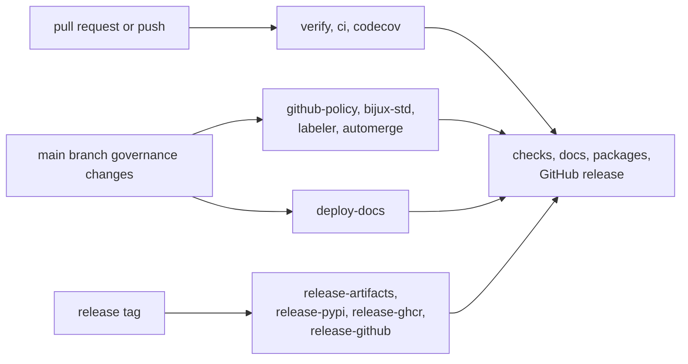

# gh-workflows

This section maps repository events to the workflow files that answer them. It
should get a maintainer from a failing run, a missing release artifact, or a
stalled docs deployment to the right YAML owner without wandering through the
Actions tab.

## What This Section Should Make Obvious

- which event starts which automation
- which workflows produce proof versus publication
- where to look first when a repository promise breaks in GitHub

## Start With

- open [verify](https://bijux.io/bijux-proteomics/08-bijux-proteomics-maintain/gh-workflows/verify/)
  when the symptom starts from a pull request or push
- open [release-workflows](https://bijux.io/bijux-proteomics/08-bijux-proteomics-maintain/gh-workflows/release-workflows/)
  when a version tag or published artifact is wrong
- open [deploy-docs](https://bijux.io/bijux-proteomics/08-bijux-proteomics-maintain/gh-workflows/deploy-docs/)
  when the handbook is stale or broken in production
- open [reusable-workflows](https://bijux.io/bijux-proteomics/08-bijux-proteomics-maintain/gh-workflows/reusable-workflows/)
  when the visible failure is only a wrapper around shared logic

## Workflow Families

- [verify](https://bijux.io/bijux-proteomics/08-bijux-proteomics-maintain/gh-workflows/verify/)
  for repository proof on pushes and pull requests
- [reusable-workflows](https://bijux.io/bijux-proteomics/08-bijux-proteomics-maintain/gh-workflows/reusable-workflows/)
  for shared building blocks called from release or governance automation
- [deploy-docs](https://bijux.io/bijux-proteomics/08-bijux-proteomics-maintain/gh-workflows/deploy-docs/)
  for handbook publication to `bijux.io`
- [release-workflows](https://bijux.io/bijux-proteomics/08-bijux-proteomics-maintain/gh-workflows/release-workflows/)
  for staged artifact assembly and final publication

## First Proof Check

- `.github/workflows/verify.yml`
- `.github/workflows/deploy-docs.yml`
- `.github/workflows/release-*.yml`, `.github/workflows/ci.yml`, and
  `.github/workflows/github-policy.yml`
