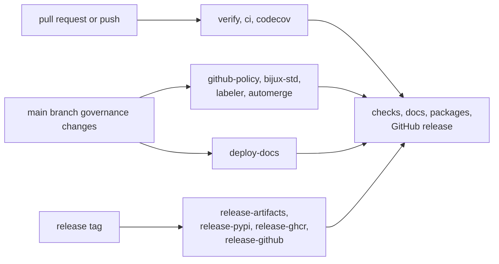
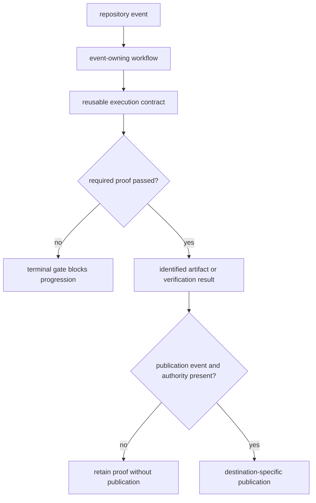

# gh-workflows

GitHub workflows translate repository events into verification, governance,
documentation, and publication graphs. Diagnose them by event, owning
workflow, reusable execution contract, and terminal gate—not by whichever job
name happens to fail last.

## Event-to-owner contract

| Event or symptom | First workflow owner | Evidence boundary |
| --- | --- | --- |
| pull request, merge group, or matching push | `verify.yml` | policy prerequisites, repository contracts, package matrix, terminal verification gate |
| package matrix failure | reusable `ci.yml` called by `verify.yml` | selected package profile, target output, and governed package artifacts |
| shared governance drift | `bijux-std.yml` or repository policy workflow | synchronized-source reference and checksum or policy evidence |
| documentation deployment failure | `deploy-docs.yml` | validated site artifact before Pages publication |
| release tag without complete artifacts | release orchestrator and `release-artifacts.yml` | built distributions, SBOMs, attestations, and package-qualified staging |
| registry or GitHub publication failure | destination-specific release workflow | publication credentials and immutable staged artifact identity |

Verification and publication are separate authorities. A successful upload
does not repair failed proof, and a green verification run does not itself
authorize a tag or registry write.

## Start With

- open [verify](https://bijux.io/bijux-proteomics/08-bijux-proteomics-maintain/gh-workflows/verify/)
  when the symptom starts from a pull request or push
- open [release-workflows](https://bijux.io/bijux-proteomics/08-bijux-proteomics-maintain/gh-workflows/release-workflows/)
  when a version tag or published artifact is wrong
- open [deploy-docs](https://bijux.io/bijux-proteomics/08-bijux-proteomics-maintain/gh-workflows/deploy-docs/)
  when the handbook is stale or broken in production
- open [reusable-workflows](https://bijux.io/bijux-proteomics/08-bijux-proteomics-maintain/gh-workflows/reusable-workflows/)
  when the visible failure is only a wrapper around shared logic

## Workflow Families

- [verify](https://bijux.io/bijux-proteomics/08-bijux-proteomics-maintain/gh-workflows/verify/)
  for repository proof on pushes and pull requests
- [reusable-workflows](https://bijux.io/bijux-proteomics/08-bijux-proteomics-maintain/gh-workflows/reusable-workflows/)
  for shared building blocks called from release or governance automation
- [deploy-docs](https://bijux.io/bijux-proteomics/08-bijux-proteomics-maintain/gh-workflows/deploy-docs/)
  for handbook publication to `bijux.io`
- [release-workflows](https://bijux.io/bijux-proteomics/08-bijux-proteomics-maintain/gh-workflows/release-workflows/)
  for staged artifact assembly and final publication

## First proof route

- `.github/workflows/verify.yml`
- `.github/workflows/deploy-docs.yml`
- `.github/workflows/release-*.yml`, `.github/workflows/ci.yml`, and
  `.github/workflows/github-policy.yml`

Begin with the event-owning workflow, resolve any `workflow_call` boundary,
then inspect the exact Make target and artifact name. A synchronized workflow
change belongs in the shared standards owner; repository-specific matrices and
inputs remain reviewable in the repository surfaces designed for them.
