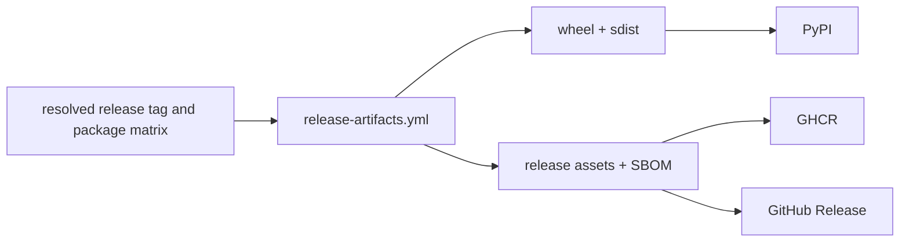

# Release workflows

Release automation separates package construction from publication to PyPI,
GHCR, and GitHub Releases. The workflows are manually dispatchable and
reusable through `workflow_call`; publication must be enabled explicitly under
the resolved release configuration.

## Artifact fan-out



`release-artifacts.yml` installs and builds each selected package, fails when no
publishable distributions exist, and uploads package-qualified artifacts with
a 14-day retention window. Registry workflows consume these artifacts instead
of rebuilding different bytes during publication.

## Publication surfaces

| Workflow | Writes | Important controls |
| --- | --- | --- |
| `release-pypi.yml` | Python registry distributions | enabled flag, artifact or maturin mode, package matrix, existing-release behavior, authentication mode |
| `release-ghcr.yml` | package artifacts in GitHub Container Registry | enabled flag, package matrix, media type, reference prefix, optional `latest` publication |
| `release-github.yml` | GitHub Release and attached assets | enabled flag, release tag/name, artifact selection, notes, unmatched-file behavior, existing-release policy |

Each publisher resolves configuration before building or publishing. Release
tags, matrices, booleans, and file selection are validated rather than accepted
as opaque shell input.

## Pre-publication proof

Before invoking a publisher:

```bash
make lock-check
make test
make quality
make security
make api
make build
make sbom
make release-preflight
```

Inspect every selected distribution's version, wheel and source archive
contents, dependency metadata, README rendering, license files, API/schema
state, and SBOM. The publication workflow is not the place to discover that
packages disagree about a version or that generated governance has drifted.

## Failure recovery

- If artifact assembly fails, correct the owning package build and create new
  artifacts; do not publish locally rebuilt bytes under the same review record.
- If one registry fails before publication, retain the uploaded workflow
  artifacts and diagnose authentication, package selection, or existing-version
  policy.
- If a registry has accepted an immutable version, do not overwrite it. Correct
  the source and publish a new version through the complete proof chain.
- If GitHub release asset selection is incomplete, correct the manifest or
  pattern before enabling publication.

Release workflows are synchronized shared governance files. Durable mechanics
change upstream; repository package matrices, release metadata, and supported
configuration remain reviewable here.
