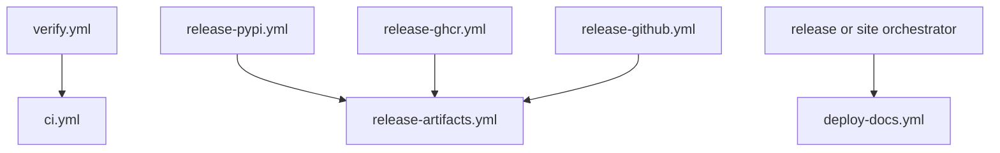

# Reusable workflows

Reusable workflows separate event policy from repeatable execution. Callers
choose when and for which package a workflow runs; the reusable workflow owns
how installation, checks, artifacts, and permissions behave.

## Reuse graph

## Package CI contract

`ci.yml` accepts package slug, package directory, artifact directory, test
Python versions, check targets, API toolchain targets, and an optional post-test
command. It creates independent jobs for:

- tests across the requested Python matrix;
- each requested quality, security, docs, API, build, or SBOM target;
- lint under Python 3.11.

Every job resolves the package-specific makefile from `makes/packages/`,
installs the package toolchain, and writes or uploads results from the declared
artifact root. Java and Node are installed only for targets that require the API
toolchain.

The caller owns matrix breadth. `ci.yml` owns consistent execution and artifact
handling. Removing a target from a caller changes verification policy even
though the reusable workflow is unchanged.

## Release artifact contract

`release-artifacts.yml` accepts one package and builds its distributions in an
isolated job. It stages:

- wheel and source archives for registry publication;
- release assets with package-qualified names;
- production and development CycloneDX SBOMs when present;
- an SBOM summary when present.

Empty publication staging is an error. Uploaded artifacts are retained for 14
days and become the immutable handoff consumed by PyPI, GHCR, or GitHub release
jobs.

## Security and ownership

Reusable workflows declare the minimum permissions needed by their work.
`ci.yml` and artifact assembly are read-only for repository contents; registry
and Pages callers add publication permissions at the boundary that needs them.

These files are synchronized from shared standards. Do not hand-edit a consumer
copy. Repository-specific behavior belongs in supported inputs, repository
configuration, make targets, and package metadata; shared mechanics belong in
the standards source.

## Review checklist

When a reusable-workflow call changes, review input defaults, package and target
matrices, artifact names and retention, permissions, concurrency cancellation,
toolchain setup, failure behavior, and the terminal gate that consumes the
result.
