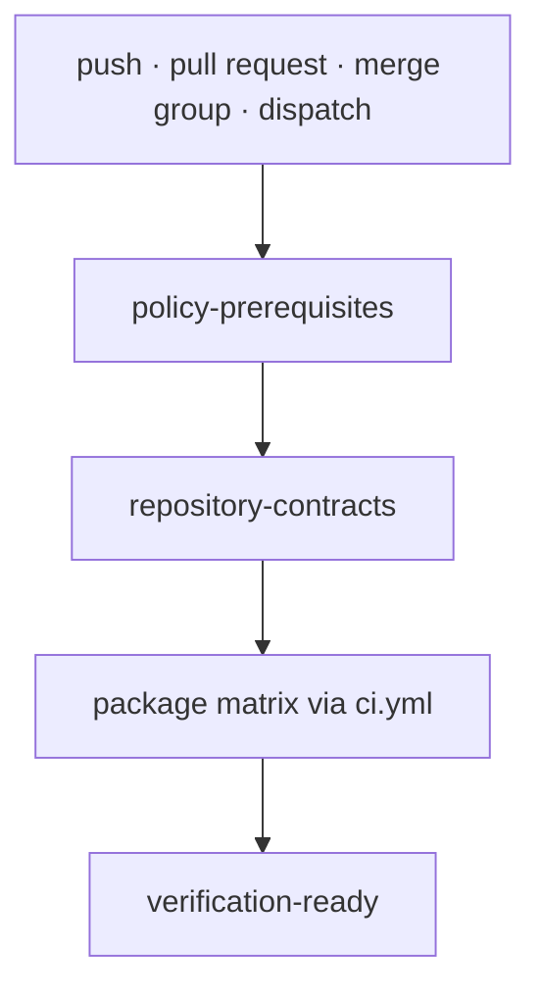

# Repository verification workflow

`.github/workflows/verify.yml` is the required repository proof graph for
changes targeting `main`. It runs for matching pushes, pull requests, merge
groups, and manual dispatches.

## Trigger scope

Path filters include product and compatibility packages, documentation,
tracked APIs, configuration, repository automation, workflow files, root build
metadata, the lock file, and MkDocs configuration. Changes outside those paths
do not start this workflow.

Concurrent runs share `verify-<git-ref>` and cancel an older in-progress run on
the same ref. This keeps review feedback current without cancelling release
automation.

## Proof graph

### Policy prerequisites

`check_workflow_prerequisites.py` waits for the repository policy and standards
checks required by the current event. A failure here means the package matrix
has not yet become authoritative; inspect policy and standards runs first.

### Repository contracts

The repository job installs Python 3.11 and uv, then validates shared make
modules, configuration layout, make layout, and the generated command index.
It must pass before package verification begins.

### Package matrix

The matrix covers the six canonical packages, `agentic-proteins`, seven alias
distributions, and `bijux-proteomics-dev`. Canonical packages normally run
tests plus quality, security, docs, API, build, and SBOM checks. Alias packages
use the narrower quality, security, docs, build, and SBOM contract. Development
tooling omits package docs and API checks.

Each package delegates to `ci.yml`, which uploads test, lint, and check artifacts
from that package's governed `artifacts/` directory. Matrix failure is not
fail-fast, so reviewers can see independent package failures in one run.

### Terminal gate

`verification-ready` runs even after dependency failures and succeeds only when
both repository contracts and the complete package matrix succeeded. Branch
protection should depend on this aggregate result rather than an arbitrary
individual matrix job.

## Diagnose a failure

1. Identify the first failed layer: policy, repository contracts, or package.
2. For a package failure, identify the matrix target and download its uploaded
   artifact when present.
3. Reproduce through the package makefile or the matching root target.
4. Correct the owning source; do not change the terminal gate or matrix to hide
   the failure.

The workflow files are synchronized governance output. Durable workflow
changes belong in the shared standards source and must return through the
repository standards refresh, while product-specific configuration remains in
the repository-owned configuration surfaces.
