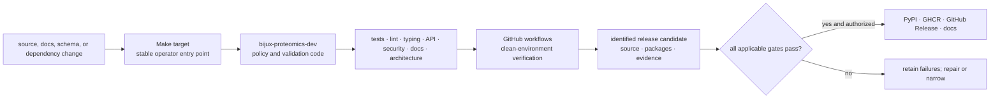
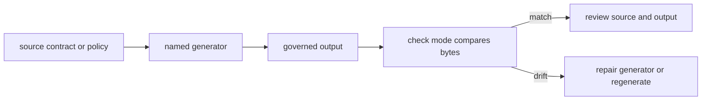
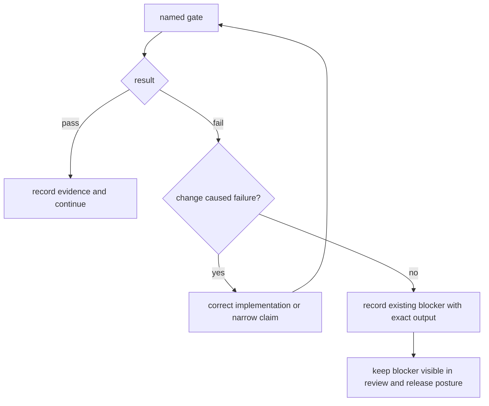
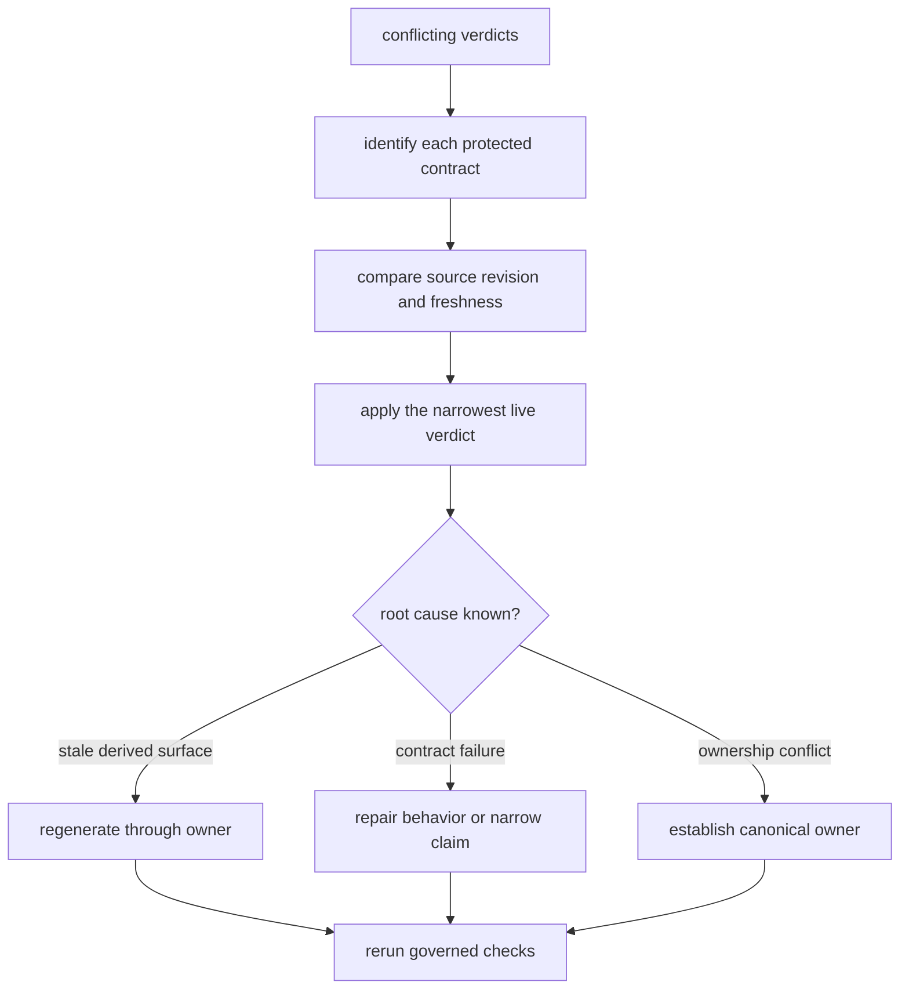

# Maintainer handbook

Repository maintenance keeps fifteen published distributions, their API
contracts, documentation, release artifacts, and scientific boundaries
coherent. Package-local checks establish local behavior; repository gates
establish whether that behavior still composes safely.

## Verification architecture



The same named Make targets are used locally and in automation. Generated API,
schema, governance, and documentation evidence is checked for drift rather than
treated as an informal review aid.

## Local workflow

From the repository root:

```bash
make ensure-venv
make test
make quality
make security
make api
make docs-check
```

Use the narrowest package target during development, then run the relevant
repository gate before committing. `make check` is the full verification flow;
`make release-preflight` applies the ordered hostile-review checks required
before a release candidate.

All generated local outputs belong under `artifacts/`. Package trees contain
source, tests, governed fixtures, and release-owned assets—not transient logs,
coverage output, caches, or ad hoc run products.

## Change-to-gate map

| Changed surface | Required focus | Evidence retained for review |
| --- | --- | --- |
| Python behavior | package tests, lint, type checks, public API types | exact package target, test result, diagnostics, and affected contract |
| package imports or dependencies | lock check, circular-import checks, dependency minimization, optional-dependency guards | lock diff, dependency owner, import boundary, and unavailable-extra behavior |
| public exports | API checks, schema freeze, API lock and compatibility review | old and new public inventories, compatibility decision, and consumer impact |
| runtime or compatibility bridge | runtime boundaries, migration ledger, migration validation | canonical target, caller parity, state or replay evidence, and unresolved consumers |
| docs or navigation | docs links, consistency, strict MkDocs build, docs hygiene | rendered route, source link, factual owner, and build result |
| architecture or package layout | canonical package tree, orphan modules, architecture regression | ownership decision, dependency direction, file inventory, and regression result |
| release metadata | builds, SBOMs, badge checks, license assets, release preflight | candidate identity, distribution inventory, attestations, and publication verdict |
| security-sensitive code | static security, vulnerability gates, dependency allowlist | finding identity, affected boundary, disposition, and closure evidence |

## Generated evidence ownership

Generated files are governed artifacts, not convenient text snapshots. The
generator owns content and ordering; the generated path owns review and
publication. A coherent change identifies both.



Hand-editing an output without updating its owner produces the same failure on
the next regeneration. Regenerating without understanding the source can hide
an unintended policy change. Review handwritten and generated diffs separately
even when correctness requires them in one commit.

## Interpret gate results



A pre-existing failure is still a failure. Distinguishing it from the current
change preserves scope; it does not make the repository green. Do not exclude,
mute, reclassify, or regenerate evidence merely to make a gate pass.

Verification output supports different claims:

| Evidence | Supports | Does not establish |
| --- | --- | --- |
| package unit tests | local behavior under covered cases | cross-package compatibility or scientific validity |
| type and quality gates | static contracts and repository policy | runtime success or publication readiness |
| documentation build | links, navigation, syntax, and configured rendering | truth of every scientific statement |
| migration validation | declared compatibility surfaces and equivalence checks | absence of undeclared consumers |
| release preflight | the ordered release policy at one revision | universal workflow validity |
| built-wheel installation | package contents and installability | end-to-end scientific readiness |

## Repository owners

- [`bijux-proteomics-dev`](bijux-proteomics-dev/index.md) implements quality,
  security, API, schema, documentation, governance, and release validators.
- [The Make system](makes/index.md) provides discoverable root commands and
  package dispatch without duplicating policy.
- [GitHub workflows](gh-workflows/index.md) run clean-environment verification,
  publication, and docs deployment.
- `configs/` contains tool and governed policy inputs; `apis/` contains tracked
  public-contract evidence.

## Safe change sequence

1. Identify the package owner and the public contract affected.
2. Change implementation and package-local tests together.
3. Regenerate governed outputs only through their owning command.
4. Inspect generated and handwritten diffs separately.
5. Run the narrow package checks and the repository gates implied by the
   change-to-gate map.
6. Confirm documentation describes released behavior and its limitations.
7. Build and inspect distributions when packaging or public data changes.

Detailed operational routes are available in
[maintainer safe change](bijux-proteomics-dev/maintainer-safe-change.md),
[quality gates](bijux-proteomics-dev/quality-gates.md),
[schema governance](bijux-proteomics-dev/schema-governance.md), and
[release support](bijux-proteomics-dev/release-support.md).

## Commit boundary

A commit represents one durable intent whose affected checks have a known
result. Selective staging keeps unrelated user work outside that intent.
Generated sync, handwritten behavior, and documentation can share a commit
when they are inseparable for correctness; otherwise they remain separate so a
reviewer can identify the policy source and its consequences.

## Release boundary

Releases are tag-driven and publish independently versioned distributions. A
green build is necessary but does not prove scientific readiness. Release
review also checks workflow-family evidence, runtime replay, grounding,
recommendation posture, lab consequence, package compatibility, and the
accuracy of public claims.

Release evidence is revision-specific. Preserve the exact source identity,
environment, commands, and failure output needed to review or repeat it.

## Current release disposition

The current repository assessment is blocked. Passing package-local checks or
building distributions does not make the release candidate publishable. The
seven-category assessment is conjunctive:

| Release category | Current status | Governing reason |
| --- | --- | --- |
| workflow-family product evidence | ready | flagship workflow and release-family manifests agree with the product architecture |
| black-box rerunability | blocked | DDA stops at imported engine exports, DIA stops before chromatogram-native replay, and multiplex remains below outsider-auditable trust |
| benchmark asset quality | blocked | duplicate belief-audit ownership and Core package-substance findings block the scientific dossier |
| documentation clarity | blocked | the DDA requested posture is stronger than its black-box allowed posture |
| package-boundary stability | ready | dependency policy, product shape, and ownership routes agree |
| artifact hygiene | ready | file ownership, drift audit, and package-root hygiene checks are clean |
| consequence realism | ready | recommendation posture remains bounded by Lab consequence and refusal surfaces |

These are release facts, not documentation defects to word around. The
[Release Readiness Matrix](../01-bijux-proteomics/foundation/release-readiness-matrix.md)
owns the revision-specific blocker codes, evidence paths, and exact details;
gate output owns the verdict for the tested revision. This handbook explains
the categories but cannot downgrade their severity or replace the generated
record.

## Release decision record

A release decision is reviewable only when it preserves:

| Field | Required value |
| --- | --- |
| source identity | exact commit and clean or explicitly described worktree state |
| candidate inventory | distributions, containers, documentation, schemas, and governed evidence under review |
| command evidence | exact gates, environment, timestamps, and retained output |
| failure disposition | owner, affected claim, whether introduced or pre-existing, and closure evidence |
| scientific ceiling | workflow-family posture after runtime, grounding, recommendation, and consequence review |
| publication decision | publish, narrow, or refuse, with the approving authority |

No failure disappears because it predates a change. No green category offsets
a red category that protects a different contract.

## Resolve Conflicting Gate Verdicts

Two green checks can protect different contracts, and a generated dashboard can
lag the evidence that feeds it. Resolve disagreement by ownership and evidence
freshness; never average verdicts or select the more convenient surface.

| Disagreement | Governing response | Release consequence |
| --- | --- | --- |
| package test passes, repository gate fails | inspect the cross-package contract named by the repository gate | repository remains blocked |
| generated dashboard disagrees with its source ledger | verify freshness, generator identity, and source revision; regenerate through the owner | derived dashboard is not authoritative until aligned |
| Runtime rerun passes, Core acceptance fails | keep operational and scientific verdicts separate | execution may be reportable; scientific claim is refused |
| documentation builds, claim-proof gate fails | correct or narrow the statement against owning evidence | rendered prose cannot ship the stronger claim |
| current check passes, retained release evidence is stale | rerun the governed check at the candidate revision | historical green evidence cannot approve the candidate |
| two owner records claim the same concept | stop and establish one canonical owner before publication | duplicate ownership is a release blocker |



[Product Overview](../01-bijux-proteomics/foundation/product-overview.md)
defines protected system contracts,
[Workflow Families](../01-bijux-proteomics/foundation/workflow-families.md)
defines scientific posture, [Runtime](../09-bijux-proteomics-runtime/index.md)
owns run evidence, and the
[Release Readiness Matrix](../01-bijux-proteomics/foundation/release-readiness-matrix.md)
collects the cross-product publication decision.

## Continue By Maintenance Question

| Need | Read next | Review is complete when |
| --- | --- | --- |
| carry one owned change through verification | [Maintainer Safe Change](bijux-proteomics-dev/maintainer-safe-change.md) | owner, contract, implementation, tests, generated outputs, and consumer impact form one reviewable intent |
| map checks to protected contracts | [Testing And Validation](../01-bijux-proteomics/operations/testing-and-validation.md) | each invoked gate names the behavior or repository promise it protects |
| build and review publication evidence | [Release Support](bijux-proteomics-dev/release-support.md) | source identity, package inventory, artifacts, attestations, gate results, and approving authority agree |
| interpret a gate failure without hiding it | [Quality gates](bijux-proteomics-dev/quality-gates.md) | the exact failure, provenance, affected claim, owner, and closure condition remain visible |
| govern schemas and API locks | [Schema governance](bijux-proteomics-dev/schema-governance.md) | old and new contracts, compatibility assessment, migration, and consumer response are explicit |
| understand documentation truth checks | [Documentation integrity](bijux-proteomics-dev/documentation-integrity.md) | public language resolves to current implementation or evidence and the strict site build passes |
