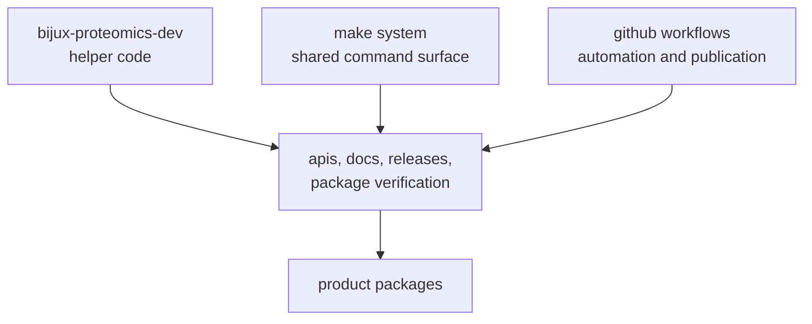

# Maintainer Handbook

`bijux-proteomics-maintain` is the repository-health handbook. It explains how
the repository keeps its promises alive: docs stay buildable, schemas stay
checked, releases stay guarded, and shared commands stay understandable.

Product packages carry the scientific and operational ideas. This handbook
carries the discipline that stops those ideas from decaying into folklore.

## What This Handbook Makes Visible

- where repository rules are executable instead of merely stated
- how local commands, CI, and release automation reinforce each other
- why a multi-package repository can stay coherent over time

## Shared Reader Routes

- Use [Maintenance](https://bijux.io/bijux-proteomics/08-bijux-proteomics-maintain/bijux-proteomics-dev/maintenance-overview/)
  when the reader still needs the repository-health route before dropping into
  one maintainer owner family.
- Use [Maintainer Safe Change](https://bijux.io/bijux-proteomics/08-bijux-proteomics-maintain/bijux-proteomics-dev/maintainer-safe-change/)
  when the question is a concrete package change rather than a general
  repository-health question.

## Start Inside This Handbook

- open [bijux-proteomics-dev](https://bijux.io/bijux-proteomics/08-bijux-proteomics-maintain/bijux-proteomics-dev/) when the rule is implemented as checked-in Python maintainer code
- open [gh-workflows](https://bijux.io/bijux-proteomics/08-bijux-proteomics-maintain/gh-workflows/) when the symptom starts from GitHub automation
- open [makes](https://bijux.io/bijux-proteomics/08-bijux-proteomics-maintain/makes/) when the question starts from `make`, CI target routing, or release command fan-out

## What This Handbook Owns

- repository-wide proof, publication, docs integrity, security, and policy enforcement
- shared command routing and GitHub automation contracts
- the boundary between package handbooks and repository-health surfaces

## What It Should Never Become

- a substitute for product-package documentation
- a vague collection of release reminders
- a place where automation hides without naming its real owner

## First Proof Check

- `packages/bijux-proteomics-dev/src/bijux_proteomics_dev/`
- `.github/workflows/`
- `Makefile` and `makes/`
