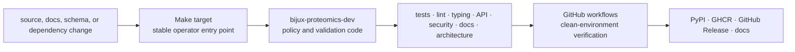
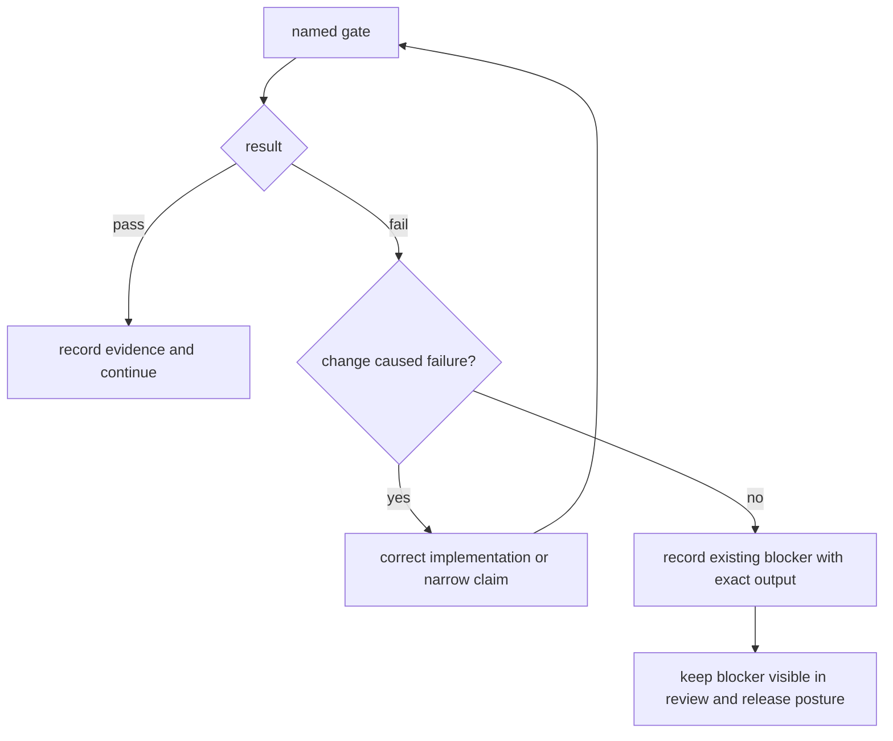

# Maintainer handbook

This handbook covers the repository-wide systems that keep fifteen published
distributions, their API contracts, documentation, release artifacts, and
scientific boundaries coherent. Package-local development remains documented
in each package handbook.

## Verification architecture



The same named Make targets are used locally and in automation. Generated API,
schema, governance, and documentation evidence is checked for drift rather than
treated as an informal review aid.

## Local workflow

From the repository root:

```bash
make ensure-venv
make test
make quality
make security
make api
make docs-check
```

Use the narrowest package target during development, then run the relevant
repository gate before committing. `make check` is the full verification flow;
`make release-preflight` applies the ordered hostile-review checks required
before a release candidate.

All generated local outputs belong under `artifacts/`. Package trees contain
source, tests, governed fixtures, and release-owned assets—not transient logs,
coverage output, caches, or ad hoc run products.

## Change-to-gate map

| Changed surface | Required focus |
| --- | --- |
| Python behavior | package tests, lint, type checks, public API types |
| package imports or dependencies | lock check, circular-import checks, dependency minimization, optional-dependency guards |
| public exports | API checks, schema freeze, API lock and compatibility review |
| runtime or compatibility bridge | runtime boundaries, migration ledger, migration validation |
| docs or navigation | docs links, consistency, strict MkDocs build, docs hygiene |
| architecture or package layout | canonical package tree, orphan modules, architecture regression |
| release metadata | builds, SBOMs, badge checks, license assets, release preflight |
| security-sensitive code | static security, vulnerability gates, dependency allowlist |

## Interpret gate results



A pre-existing failure is still a failure. Distinguishing it from the current
change preserves scope; it does not make the repository green. Do not exclude,
mute, reclassify, or regenerate evidence merely to make a gate pass.

Verification output supports different claims:

| Evidence | Supports | Does not establish |
| --- | --- | --- |
| package unit tests | local behavior under covered cases | cross-package compatibility or scientific validity |
| type and quality gates | static contracts and repository policy | runtime success or publication readiness |
| documentation build | links, navigation, syntax, and configured rendering | truth of every scientific statement |
| migration validation | declared compatibility surfaces and equivalence checks | absence of undeclared consumers |
| release preflight | the ordered release policy at one revision | universal workflow validity |
| built-wheel installation | package contents and installability | end-to-end scientific readiness |

## Repository owners

- [`bijux-proteomics-dev`](bijux-proteomics-dev/index.md) implements quality,
  security, API, schema, documentation, governance, and release validators.
- [The Make system](makes/index.md) provides discoverable root commands and
  package dispatch without duplicating policy.
- [GitHub workflows](gh-workflows/index.md) run clean-environment verification,
  publication, and docs deployment.
- `configs/` contains tool and governed policy inputs; `apis/` contains tracked
  public-contract evidence.

## Safe change sequence

1. Identify the package owner and the public contract affected.
2. Change implementation and package-local tests together.
3. Regenerate governed outputs only through their owning command.
4. Inspect generated and handwritten diffs separately.
5. Run the narrow package checks and the repository gates implied by the
   change-to-gate map.
6. Confirm documentation describes released behavior and its limitations.
7. Build and inspect distributions when packaging or public data changes.

Start with [maintainer safe change](bijux-proteomics-dev/maintainer-safe-change.md)
for detailed routing, [quality gates](bijux-proteomics-dev/quality-gates.md) for
verification, [schema governance](bijux-proteomics-dev/schema-governance.md)
for compatibility, and [release support](bijux-proteomics-dev/release-support.md)
for publication.

## Release boundary

Releases are tag-driven and publish independently versioned distributions. A
green build is necessary but does not prove scientific readiness. Release
review also checks workflow-family evidence, runtime replay, grounding,
recommendation posture, lab consequence, package compatibility, and the
accuracy of public claims.

Release evidence is revision-specific. Preserve the exact source identity,
environment, commands, and failure output needed to review or repeat it.
