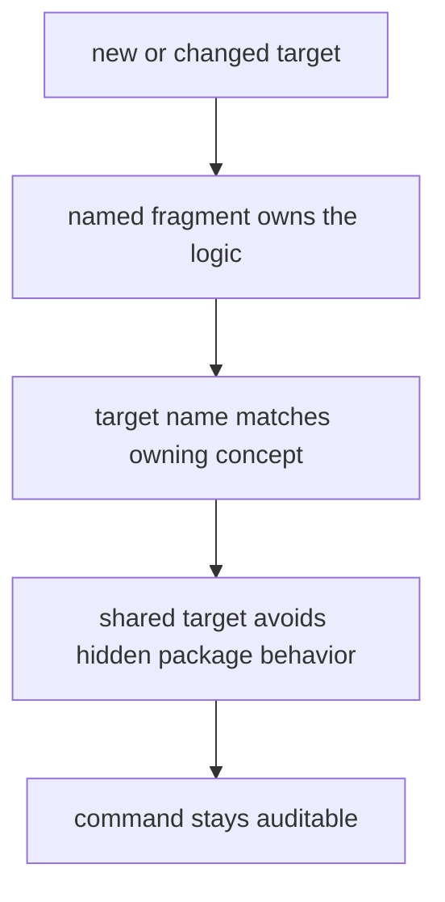

# Authoring Rules

Make authoring rules should keep the command surface auditable as it grows.

## Authoring Model

This page should help a maintainer judge whether a make change preserves command traceability or starts hiding behavior behind convenient target sprawl.

## Rules

- prefer named fragments over dense inline shell logic
- keep target names and file names aligned with the owning concept
- refactor when shared targets start hiding package-specific behavior

## First Proof Check

- `Makefile`
- `makes/root.mk` and related fragments

## Design Pressure

The easy failure is to grow one more convenient target until the command surface stops revealing which fragment or package really owns the work.
