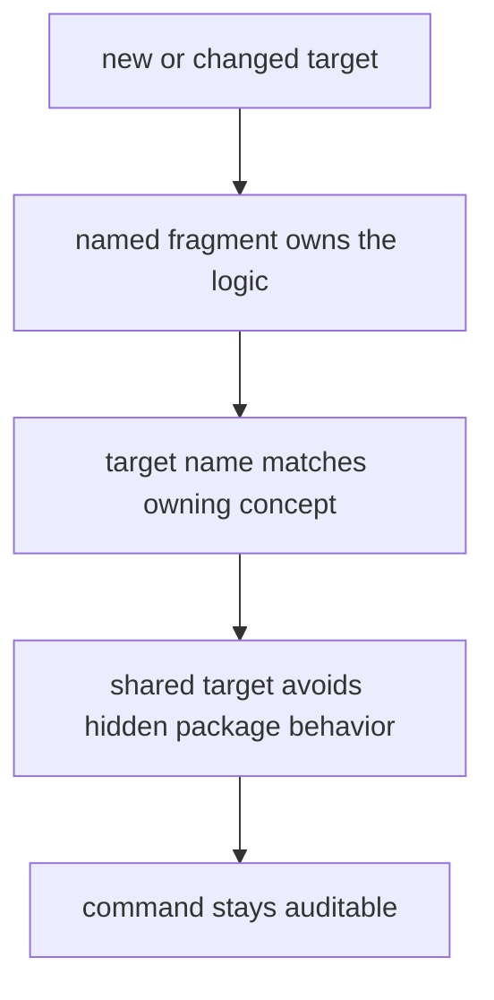
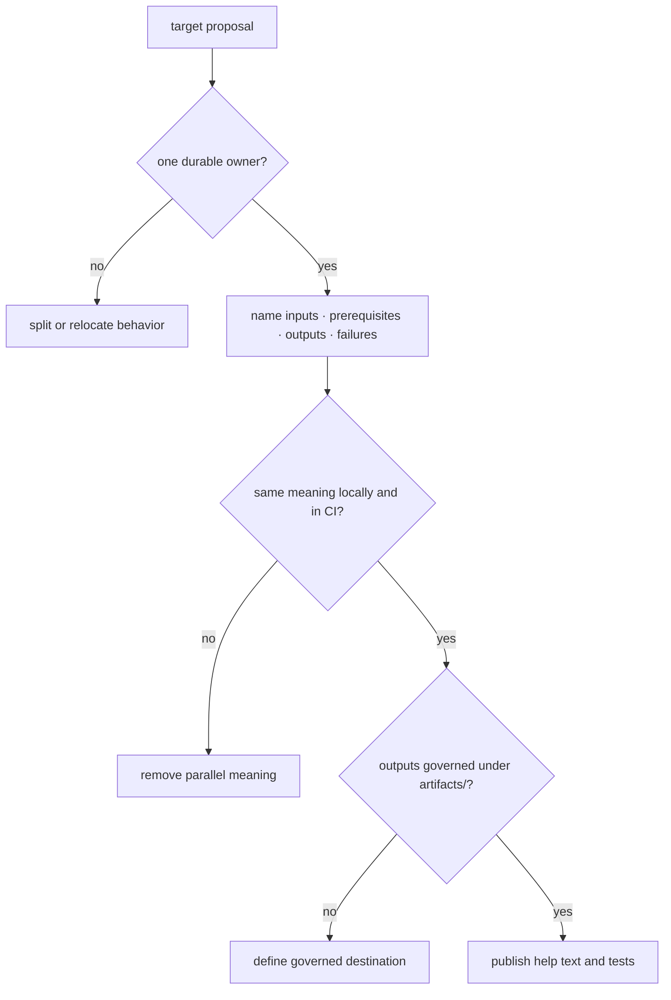

# Authoring Rules

Make targets are public operator contracts when they appear in `make help` or
CI. Their names, prerequisites, environment, artifacts, and failure behavior
must remain understandable without reading an opaque recipe body.

## Authoring Model

The smallest correct owner is preferred: shared mechanics in synchronized
fragments, repository policy in a tested repository helper, package variation
in a named profile, and top-level aliases in `makes/root.mk`.

## Place behavior by ownership

| Behavior | Correct owner | Reject when |
| --- | --- | --- |
| thin public alias or prerequisite ordering | `makes/root.mk` or a named repository fragment | recipe embeds domain policy or long shell control flow |
| package inventory and capability membership | `makes/packages.mk` | package selection is inferred from directory globs |
| package-specific variables and narrow overrides | `makes/packages/<package>.mk` | shared recipe branches repeatedly on package name |
| reusable Python-project mechanics | synchronized `makes/bijux-py/` modules | repository-only assumptions enter shared mechanics |
| quality, governance, or release decision | tested `bijux-proteomics-dev` implementation | Make recipe becomes the only policy definition |
| generated output | named generator plus governed destination | recipe hand-edits or silently normalizes tracked evidence |

## Target acceptance checklist

A new public target needs a durable verb and object, a help description, a
declared `.PHONY` posture when appropriate, and a direct path to the owner that
can be tested independently. Composite targets list prerequisites; they do not
copy child recipes.

## Rules

- prefer named fragments over dense inline shell logic;
- keep target names and file names aligned with the owning concept;
- quote paths and propagate nonzero exits from every child process;
- never use a successful summary line to conceal a failed prerequisite;
- keep generated outputs, caches, and reports under governed destinations;
- replace repeated package conditionals with capability groups or profiles;
- add event mechanics in workflows without changing the root target’s proof
  meaning.

## First proof route

Trace the proposed command from `make help` through its declaration,
prerequisites, selected package group, profile, implementation, and artifact
path. Run the narrow target once in a developer shell and inspect the workflow
invocation that relies on the same meaning.

## Design Pressure

Target count is not the main risk; hidden semantic duplication is. Two commands
that look distinct but execute the same owned contract may be aliases. Two
commands with the same name but different local and CI meanings are a defect.
