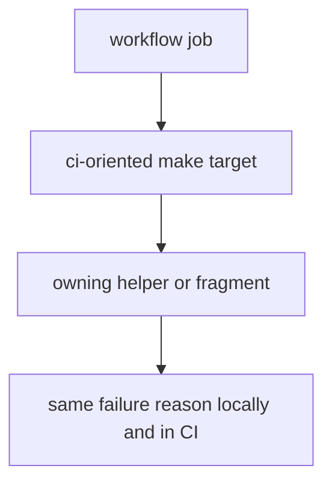

# CI Targets

CI targets should mirror repository proof rules closely enough that local runs and workflow runs mean the same thing.

## CI Model

This page should make CI targets feel like a stable proof interface. If local and workflow invocations mean different things, the maintainer command layer is already drifting.

## CI Rules

- keep CI-oriented targets explicit and reusable
- align make targets with workflow expectations instead of creating parallel meanings
- surface failures at the target that owns them

## First Proof Check

- `makes/bijux-py/ci/`
- workflow files that call the targets

## Design Pressure

The common drift is to let workflows and make targets evolve in parallel until identical-looking commands stop proving the same repository rule.
