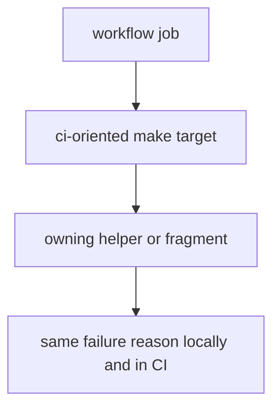
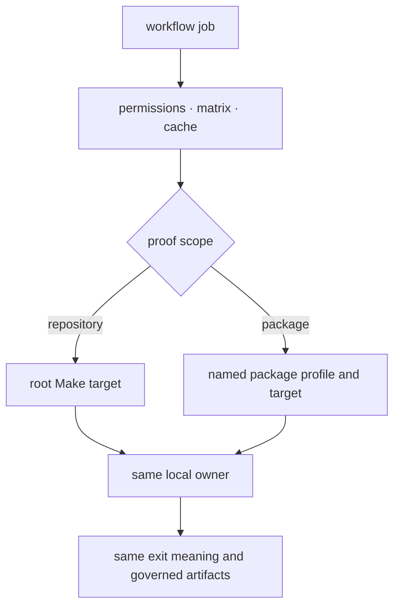

# CI Targets

CI uses the same Make contracts as local verification. Workflows add event
permissions, matrices, caches, artifact upload, and publication credentials;
they do not create alternate definitions of testing, quality, security, API
compatibility, or builds.

## CI Model

Two invocation levels are intentional. Repository jobs call root targets.
Reusable package jobs select the same named profile used by root dispatch and
invoke it with `make -f <profile> -C <package> <target>`.

## Workflow invocation map

| Workflow concern | Make route | CI-only responsibility |
| --- | --- | --- |
| repository structure | root `check-shared-bijux-py`, `check-config-layout`, `check-make-layout`, and `help` | checkout and job reporting |
| package tests | selected package profile `install`, then `test` | package matrix and artifact upload |
| package lint, quality, security, API, build, or SBOM | selected profile and named target | matrix selection, cache, and runner environment |
| shared standards | root standards check | upstream reference and credentials |
| documentation | root docs preparation and build target | deployment environment and Pages publication |
| release artifacts | selected package profile and release target | tag validation, attestations, and publication credentials |

The package profile path is derived from the selected package directory, not
copied as a second capability inventory in workflow logic. A workflow failure
should therefore be reproducible by the printed Make invocation once the same
environment inputs are supplied.

## CI rules

- keep repository and package targets directly runnable outside Actions;
- confine matrices, permissions, caches, and upload mechanics to workflows;
- select packages through declared profiles and capabilities;
- preserve the target’s nonzero exit and owner output;
- upload evidence without treating upload success as proof success;
- change Make ownership before changing a workflow to bypass a missing target.

## First proof route

Read the workflow’s exact command, resolve its package profile or root target,
and compare the environment variables and artifact paths with a local
invocation. Inspect `makes/bijux-py/ci/` only after the selected profile shows
which shared target implementation is active.

## Design Pressure

CI drift is present when a workflow replaces a failing target with direct tool
calls, narrows a matrix without changing capability ownership, or uploads an
artifact from a command whose failure was ignored. The fix belongs at the
shared proof contract, not in workflow-only shell.
