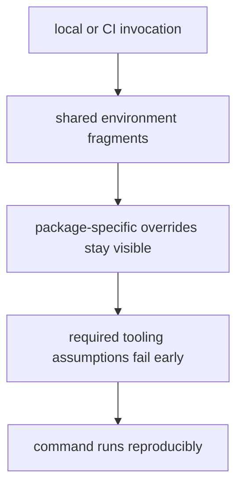

# Environment Model

Environment handling should make local and CI execution reproducible without hiding required assumptions.

## Environment Model

This page should make environment handling feel like explicit setup logic rather than implicit shell state. Reproducibility depends on visible assumptions, not on lucky machine parity.

## Environment Rules

- centralize shared environment logic in dedicated fragments
- keep package-specific overrides visible
- fail early when required tooling assumptions are missing

## First Proof Check

- `makes/env.mk`
- env-related includes under `makes/bijux-py/`

## Design Pressure

The easy failure is to make environment handling feel smooth by hiding assumptions until they break differently on another machine or in CI.
