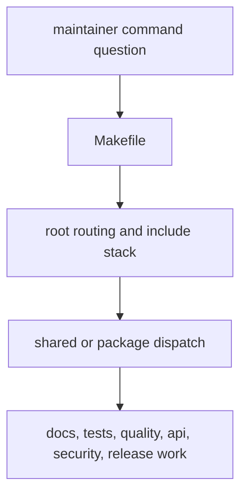
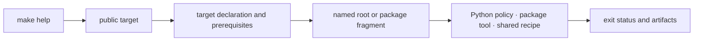

# makes

The repository exposes one Make command plane for local development, CI, and
release evidence. Every public target resolves through a named include or
package profile, invokes an inspectable implementation, writes governed output
under `artifacts/`, and preserves child failures.

The Make layer routes work; it does not redefine scientific, quality, security,
or release policy in opaque shell recipes. Those policies remain in their
owning Python modules, package tools, and governed configurations.

## Choose the narrowest command

| Intent | Public command | Dispatch scope | Result |
| --- | --- | --- | --- |
| discover supported entrypoints | `make help` | root include inventory | categorized command list from live target metadata |
| verify one package | `make test PACKAGE=<package>` | one declared package profile | package result with package-owned artifacts |
| verify a repository contract | `make quality-docs-links`, `make architecture-check`, or another named root gate | one cross-package invariant | explicit policy verdict |
| build the public site | `make docs-check` | synchronized docs shell and strict MkDocs input | disposable build verification plus hygiene check |
| assemble broad evidence | `make check` | ordered repository verification surface | aggregate nonzero result when any required child fails |
| assess publication | `make release-preflight` | hostile-review release policy | revision-specific publish, narrow, or refuse evidence |

Broad commands are not substitutes for understanding a failed child target.
Use the narrow owner command to diagnose, then rerun the composite surface that
made the child mandatory.

## Trace a target to its owner

Start at the target declaration, follow prerequisites in order, resolve any
package group through `makes/packages.mk`, and inspect the selected profile
under `makes/packages/`. A target is not traceable when its effective owner can
only be discovered from runtime side effects.

## Command-plane guarantees

- one command vocabulary for local work, CI, and release preparation
- explicit routing from the root entrypoint into shared and package-specific
  make logic
- reviewable command ownership instead of hidden shell glue

## Start With

- open [Root Entrypoints](https://bijux.io/bijux-proteomics/08-bijux-proteomics-maintain/makes/root-entrypoints/)
  when the question starts from `Makefile`
- open [Package Dispatch](https://bijux.io/bijux-proteomics/08-bijux-proteomics-maintain/makes/package-dispatch/)
  when the issue is how a target reaches one package or many
- open [Make System Overview](https://bijux.io/bijux-proteomics/08-bijux-proteomics-maintain/makes/make-system-overview/)
  when you need the whole include stack and naming model
- open [CI Targets](https://bijux.io/bijux-proteomics/08-bijux-proteomics-maintain/makes/ci-targets/)
  when the command question starts from GitHub logs rather than a local shell

## Read By Dispatch Problem

- [Environment Model](https://bijux.io/bijux-proteomics/08-bijux-proteomics-maintain/makes/environment-model/)
  for the variables that shape command behavior
- [Repository Layout](https://bijux.io/bijux-proteomics/08-bijux-proteomics-maintain/makes/repository-layout/)
  and [Package Contracts](https://bijux.io/bijux-proteomics/08-bijux-proteomics-maintain/makes/package-contracts/)
  for understanding why dispatch lands where it does
- [Release Surfaces](https://bijux.io/bijux-proteomics/08-bijux-proteomics-maintain/makes/release-surfaces/)
  and [Authoring Rules](https://bijux.io/bijux-proteomics/08-bijux-proteomics-maintain/makes/authoring-rules/)
  for maintaining the command surface without turning it into ad hoc scripting

## First proof route

- `Makefile`
- `makes/root.mk`, `makes/packages.mk`, and `makes/publish.mk`
- `makes/bijux-py/` and `makes/packages/`

## Design Pressure

The critical failure is a familiar command whose meaning differs between a
developer shell and CI, or whose generated output escapes repository artifact
governance. Both are contract drift even when the underlying tool succeeds.
