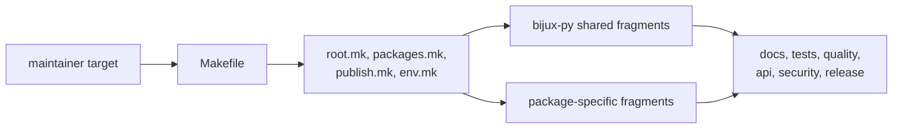

# makes

This section explains how a maintainer command turns into repository work. It
should help a reader move from `make <target>` to the owning fragment, the
reused include stack, and the package or repository scope that target actually
touches.

## What This Surface Is For

- one command vocabulary for local work, CI, and release preparation
- explicit routing from the root entrypoint into shared and package-specific
  make logic
- reviewable command ownership instead of hidden shell glue

## Start With

- open [Root Entrypoints](https://bijux.io/bijux-proteomics/08-bijux-proteomics-maintain/makes/root-entrypoints/)
  when the question starts from `Makefile`
- open [Package Dispatch](https://bijux.io/bijux-proteomics/08-bijux-proteomics-maintain/makes/package-dispatch/)
  when the issue is how a target reaches one package or many
- open [Make System Overview](https://bijux.io/bijux-proteomics/08-bijux-proteomics-maintain/makes/make-system-overview/)
  when you need the whole include stack and naming model
- open [CI Targets](https://bijux.io/bijux-proteomics/08-bijux-proteomics-maintain/makes/ci-targets/)
  when the command question starts from GitHub logs rather than a local shell

## Read By Dispatch Problem

- [Environment Model](https://bijux.io/bijux-proteomics/08-bijux-proteomics-maintain/makes/environment-model/)
  for the variables that shape command behavior
- [Repository Layout](https://bijux.io/bijux-proteomics/08-bijux-proteomics-maintain/makes/repository-layout/)
  and [Package Contracts](https://bijux.io/bijux-proteomics/08-bijux-proteomics-maintain/makes/package-contracts/)
  for understanding why dispatch lands where it does
- [Release Surfaces](https://bijux.io/bijux-proteomics/08-bijux-proteomics-maintain/makes/release-surfaces/)
  and [Authoring Rules](https://bijux.io/bijux-proteomics/08-bijux-proteomics-maintain/makes/authoring-rules/)
  for maintaining the command surface without turning it into ad hoc scripting

## First Proof Check

- `Makefile`
- `makes/root.mk`, `makes/packages.mk`, and `makes/publish.mk`
- `makes/bijux-py/` and `makes/packages/`
