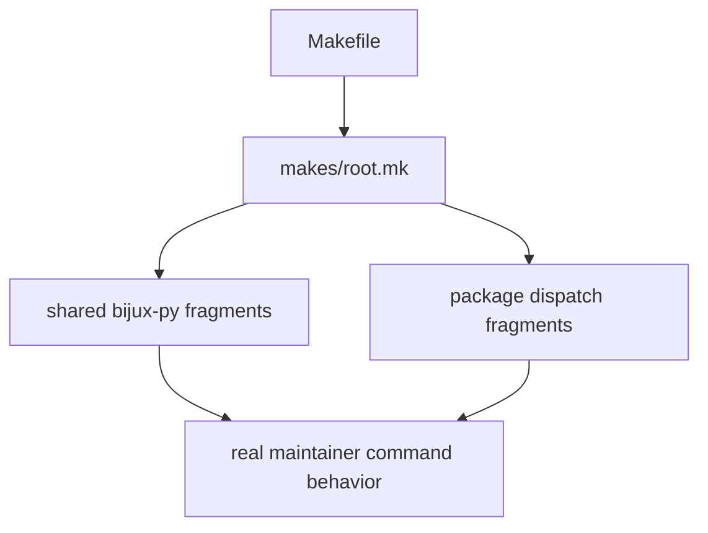

# Make System Overview

The make system is a real interface, not a random collection of shortcuts.

## System Model

This page should give the shortest honest picture of how command ownership fans out from the root entrypoint. The structure matters because it is the only way to keep command review from collapsing into include-file guesswork.

## Overview

- `Makefile` is the top entry surface
- shared routing lives in `makes/root.mk`, `makes/packages.mk`, `makes/publish.mk`, and `makes/env.mk`
- package and repository detail fan out through `makes/bijux-py/` and `makes/packages/`

## First Proof Check

- `Makefile`
- `makes/README.md`

## Design Pressure

The common drift is to keep extending the include stack until command ownership becomes something a maintainer has to reconstruct manually.
