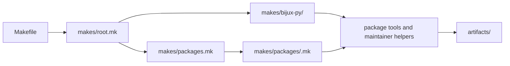

# Make system overview

The root Make interface gives local development and CI one command vocabulary
for environment setup, package dispatch, documentation, contracts, security,
builds, and release proof. It composes behavior from named fragments so a target
can be traced without reading one monolithic Makefile.

## Include and execution model

`Makefile` is intentionally shallow. `makes/root.mk` assembles repository
entrypoints, environment rules, package inventory, documentation, standards,
and release fragments. Shared Python-project behavior lives in
`makes/bijux-py/`; repository-specific package capabilities live in
`makes/packages/`.

## Public command layers

| Layer | Representative commands | Scope |
| --- | --- | --- |
| discovery and setup | `help`, `list`, `install`, `lock-check` | repository environment and inventory |
| package dispatch | `lint`, `test`, `quality`, `security`, `api`, `build`, `sbom` | one selected package or a governed package group |
| documentation | `docs`, `docs-check`, `docs-serve` | public site preparation and rendering |
| repository policy | `quality-artifact-governance`, `api-freeze`, `architecture-check` | named cross-package invariants |
| release | `release-preflight` and publication targets | coordinated release evidence |
| composite | `check`, `all` | broad repository workflows |

Run `make help` for the current public inventory. Deep fragment targets are
implementation details unless documented as supported commands.

## Adding or changing a command

Place the target at the narrowest layer that owns its behavior. Package-local
behavior belongs in the package profile or shared package implementation;
cross-package policy belongs in a named root fragment and preferably a tested
maintainer helper. Root aliases remain thin and descriptive.

Trace prerequisites, environment inputs, package groups, output paths, and exit
propagation. A composite target must not swallow a child failure. Avoid recipes
that reproduce policy already implemented in Python or in another shared
fragment.

## Local and CI parity

Workflows invoke root Make targets and supply event-specific concerns such as
permissions, matrices, and caches. They do not own alternate definitions of
quality, testing, or publication. When local and CI behavior differs, inspect
the workflow inputs and environment overlay before adding a second command.
