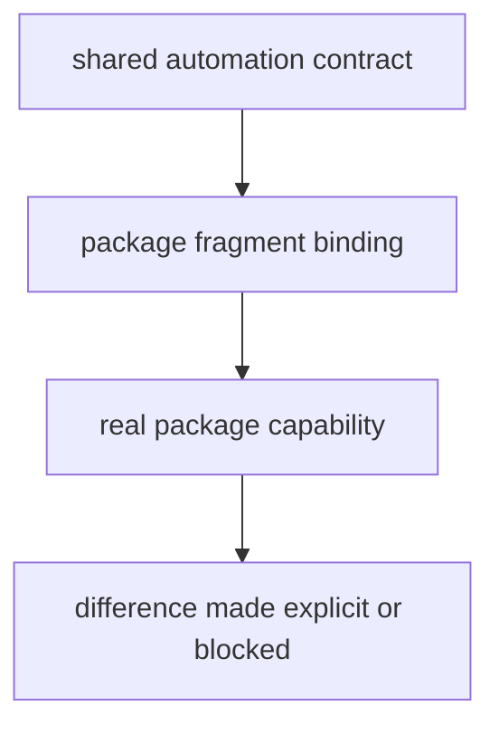
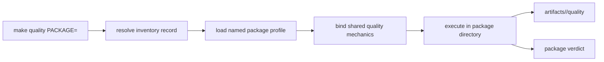

# Package Contracts

Package dispatch is capability-based. Each inventory record names a package,
the root target groups it supports, and the profile that binds its paths and
overrides to shared mechanics.

## Contract Model



An inventory record has the form:

```text
package-name | capability-groups | package-profile.mk
```

The current groups distinguish primary packages, check participation,
buildable distributions, SBOM generation, and API contracts. Membership is a
promise that the package profile can execute the corresponding target with the
repository’s declared meaning.

## Dispatch contract

| Contract field | Owner | Required property |
| --- | --- | --- |
| package name | `makes/packages.mk` | matches a real directory and public selector |
| capability groups | inventory record | includes only targets the package genuinely implements |
| profile path | inventory record | resolves to one named file under `makes/packages/` |
| import and source paths | package profile | identify actual public and testable package surfaces |
| configuration and dependency paths | package profile | resolve from repository root without caller-specific guesses |
| artifact root | dispatcher | isolates output under `artifacts/<package>/` |
| shared environment | root target declaration | is explicit for targets that require the common check environment |
| aggregate result | dispatcher | preserves every package failure and exits nonzero when any package fails |



Without `PACKAGE`, the root target selects its declared group and continues
through the full set to report aggregate failures. With `PACKAGE`, an unknown
name fails against the live inventory rather than falling through to a guessed
profile.

## Contract rules

- map each capability group to real package behavior;
- keep package-specific paths and supported variations in the profile;
- keep the meaning of `test`, `quality`, `security`, `api`, `build`, and `sbom`
  consistent across participating profiles;
- use a named package target when a variation changes that meaning;
- reject undeclared package directories and missing profiles.

## First proof route

Inspect the inventory record, then the selected profile, then the shared module
it includes. Run one narrow command with `PACKAGE=<name>` and verify its source
scope, configuration, artifact path, and failure status. Use a group invocation
to confirm the package participates where the inventory claims it does.

## Design Pressure

The critical drift is a profile that makes a shared target pass by weakening
its meaning—for example, disabling a required checker or redirecting tests to
a smaller unannounced scope. Explicit variation is reviewable; semantic
substitution is not.
