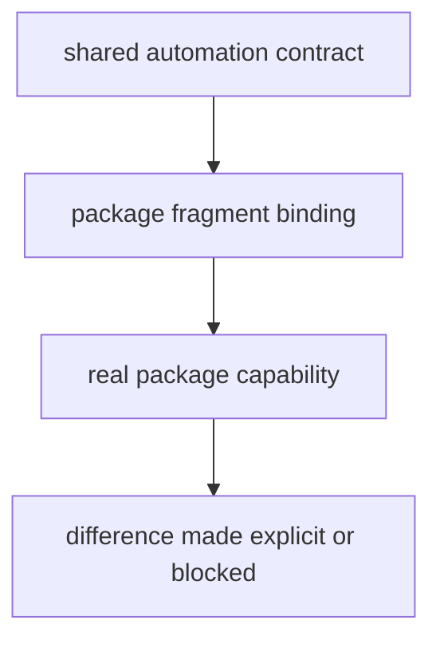

# Package Contracts

Make fragments encode package contracts too. They show what each package is expected to provide for shared automation.

## Contract Model

This page should help a maintainer see package dispatch as a contract surface, not just repetitive make syntax. Shared automation stays honest only when each fragment maps to a real package capability.

## Contract Rules

- each package target family should map to a real package capability
- shared automation should not assume hidden package behavior
- when a package differs, document the difference explicitly in its fragment

## First Proof Check

- `makes/packages/agentic-proteins.mk`
- `makes/packages/bijux-proteomics-*.mk`

## Design Pressure

The easy failure is to let shared automation assume behavior a package never formally agreed to provide, which turns make dispatch into implicit policy.
