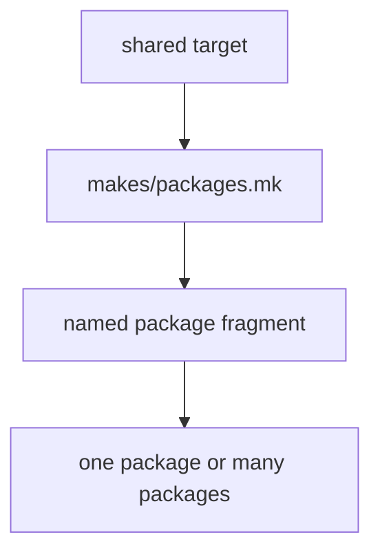

# Package Dispatch

Package dispatch should explain how one target reaches one package or many without hiding the routing logic.

## Dispatch Model

This page should make dispatch feel explicit at every hop. If a maintainer cannot tell why a target reached one package or all of them, the routing surface is too implicit to trust.

## Dispatch Rules

- dispatch through named package fragments
- keep per-package routing explicit in `makes/packages/*.mk`
- avoid shared targets that secretly special-case one package too much

## First Proof Check

- `makes/packages.mk`
- `makes/packages/*.mk`

## Design Pressure

The common drift is to preserve a neat shared target name while burying package-specific special cases deep enough that the dispatch story stops being obvious.
