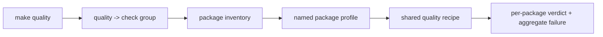

# Package dispatch

Package dispatch maps one public target to the packages that declare the
required capability. The inventory in `makes/packages.mk` is the source of
truth for package names, groups, and profile fragments.

## Inventory records

Each record has three fields:

```text
package-name | capability-groups | package-profile.mk
```

Groups such as `primary`, `check`, `api`, `buildable`, and `sbom` determine
which packages receive a root target. The package profile then supplies import
names, dependency paths, test selection, coverage floors, and other explicit
overrides before including shared package behavior.



## Select one package

Use the `PACKAGE` variable with a root dispatch target:

```bash
make test PACKAGE=bijux-proteomics-core
make quality PACKAGE=bijux-proteomics-knowledge
make api PACKAGE=agentic-proteins
make build PACKAGE=bijux-proteomics-lab
```

Unknown package names fail with the valid inventory. Without `PACKAGE`, the
target selects its configured group. For example, API dispatch uses packages
with API capability, while build dispatch uses buildable packages.

## Execution contract

The dispatcher resolves the profile, prepares the shared check environment when
the target requires it, assigns package-specific source and artifact paths, and
invokes Make inside the package with the selected profile. Package output goes
to `artifacts/<package>/`.

Dispatch continues across the selected package set when a package fails and
prints the aggregate failure list at the end. This behavior exposes the full
repository state while preserving a nonzero exit code.

## Add a package or capability

Add the package directory, a named profile under `makes/packages/`, and one
inventory record. Assign only capabilities the package actually supports. The
catalog rejects missing package directories, missing profiles, and undeclared
package directories, keeping the filesystem and dispatch inventory aligned.

Prefer a profile variable over a package-name conditional buried in shared
recipes. If an override changes the meaning of a shared target substantially,
the package needs a named target or clearer capability boundary rather than an
invisible special case.
