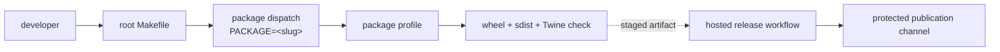

# Release Surfaces

The Make release surface separates repeatable local proof from credentialed
publication. The distinction is operationally important: building archives is
safe to repeat, while uploading an immutable package version is not.

## Command Routing



The root `build` target dispatches to publishable package profiles. With no
selector it builds the configured package set; with `PACKAGE=<slug>` it limits
the operation to one package:

```bash
make build PACKAGE=bijux-proteomics-core
```

Each package build writes a wheel, source distribution, and
`twine-check.log` under `artifacts/<package>/build/`. Package failures are
collected and reported together, so one failure does not hide the status of the
remaining package matrix.

## Target Semantics

| Target | Effect | Publication risk |
| --- | --- | --- |
| `make build` | Build package archives and run Twine metadata checks. | No upload. |
| `make release-preflight` | Run the ordered repository release-governance gates. | No upload. |
| `make check` | Run the full repository verification flow, including build and documentation checks. | No upload. |
| `make publish` | Not exposed by the root Make graph. | Fails without publishing. |

Use `make build` and `make release-preflight` during ordinary development.
Publication belongs to an enabled release workflow and an intentional release
operator. Do not create an ad hoc root target or direct Twine command to bypass
the hosted controls.

## Build and Guard Components

The active root Make graph includes the shared build implementation, which
requires a package `pyproject.toml`, creates a wheel and source distribution,
and runs Twine against both archives. `makes/publish.mk` and
`makes/bijux-py/repository/publish.mk` contain publication-policy components,
but the root `Makefile` does not include them. They are implementation material
for an explicit release integration, not evidence of an available command.

A complete integration of those components requires:

1. a resolvable version other than `0.0.0`;
2. no prerelease or local-version marker unless explicitly authorized;
3. at least one wheel and one source distribution;
4. archive versions equal to the resolved source version;
5. successful Twine metadata validation;
6. credentials before an upload begins.

The fragment's policy sets `PUBLISH_ALLOW_PRERELEASE=0` and
`PUBLISH_ALLOW_LOCAL_VERSION=0`. Changing either value is a release decision and
must be visible in the release record; it is not a generic workaround for a
dirty checkout or missing tag. The fragment must also reference the canonical
modules under `release.versioning` and `release.governance` before it can be
wired into an active target.

## Workflow Correspondence

Local targets establish package-level proof. GitHub workflows add controls that
only the hosted release environment can provide: an explicitly enabled release,
a validated package matrix, tagged-commit CI status, protected credentials or
trusted publishing, staged artifact transfer, registry publication, and GitHub
Release assembly. The shared PyPI workflow supports `artifact` and `maturin`
modes; this Python package family uses the artifact matrix when configured.
A local success does not bypass those controls, and a workflow must not replace
version or artifact checks merely because it owns the credentials.

When a release fails, preserve the failing target and artifact logs under
`artifacts/`. Correct the source, metadata, or release configuration at its
owner, rebuild from a clean state, and rerun the same gate before publication.
