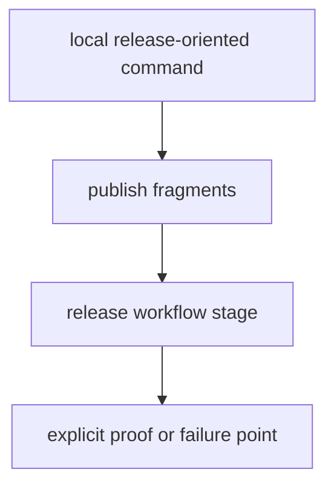

# Release Surfaces

Release surfaces are where local commands and publication workflows meet. They deserve explicit routing and explicit failure points.

## Release Model

This page should make release targets feel like controlled publication gates rather than convenience shortcuts. The command surface is only safe while each release step still has an obvious proof point.

## Release Rules

- keep publication targets easy to trace from the root surface
- align make release targets with workflow release stages
- treat release shortcuts that skip proof as defects

## First Proof Check

- `makes/publish.mk`
- release workflow files under `.github/workflows/`

## Design Pressure

The easy failure is to add a release shortcut that feels efficient locally but quietly skips the proof a workflow would have enforced.
