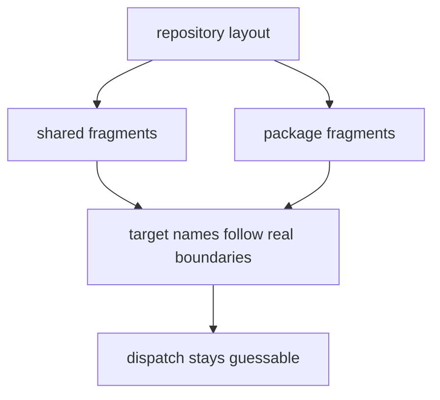

# Repository Layout

Make routing reflects repository layout. If the layout and the targets drift apart, maintainer work becomes guesswork.

## Layout Model

This page should show why repository layout matters to the make layer: target names and fragment boundaries are easier to audit when they mirror real ownership.

## Layout Rules

- shared repository targets stay in shared fragments
- package-specific rules stay under `makes/packages/`
- keep naming aligned with real repository and package boundaries

## First Proof Check

- `makes/`
- `makes/packages/`

## Design Pressure

The common drift is to let target organization follow historical convenience even after the repository layout and ownership model have changed underneath it.
