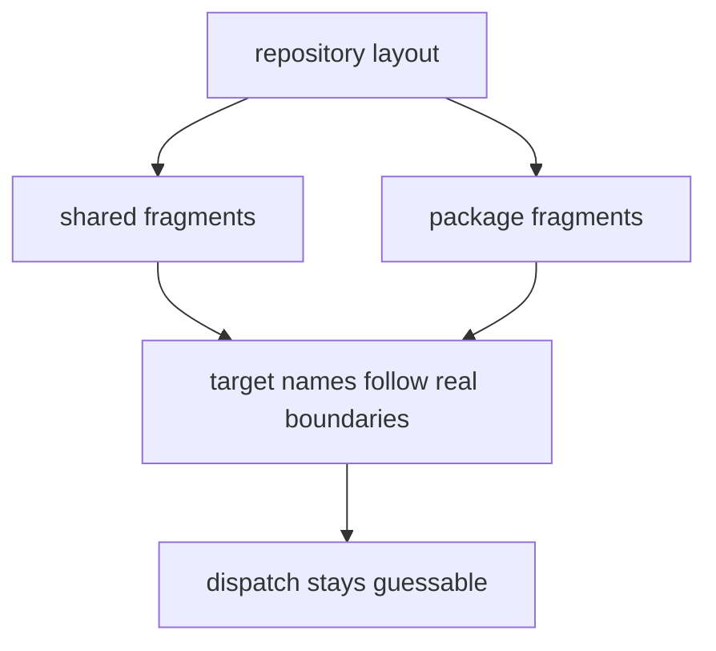
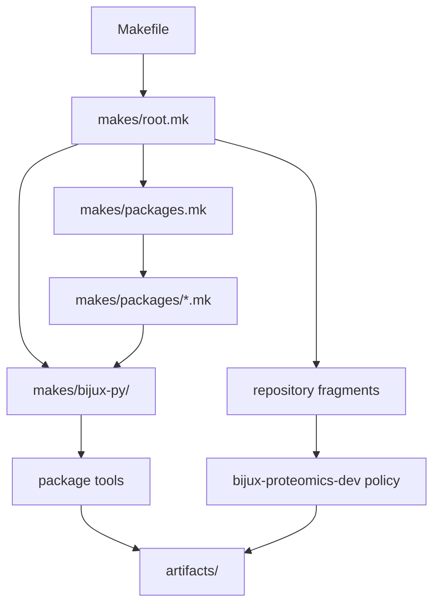

# Repository Layout

Make routing mirrors durable repository ownership. The root assembles command
families, the inventory declares packages and capabilities, profiles bind each
package to shared mechanics, and repository helpers own cross-package policy.

## Layout Model



The layout deliberately separates repository assembly from synchronized
mechanics and package variation.

```text
Makefile                         single root include
makes/root.mk                    repository assembly and public aliases
makes/packages.mk                package records and capability groups
makes/packages/<package>.mk      package profile bindings
makes/bijux-py/                  synchronized Python-project mechanics
makes/bijux-docs.mk              repository documentation integration
makes/bijux-std.mk               shared-standard integration
makes/publish.mk                 publication mechanics
packages/bijux-proteomics-dev/   tested repository policy implementations
artifacts/                       local generated output and evidence
```

## Dependency direction



Package profiles may configure shared mechanics; shared mechanics must not
discover repository-specific ownership by importing profiles. Repository
policy may call package tools, but package tools do not depend on the root Make
assembly.

## Ownership matrix

| Change | Primary file | Coupled evidence |
| --- | --- | --- |
| add or remove a package | package directory, `makes/packages.mk`, named profile | inventory and make-layout validation |
| change a package capability | inventory record and profile | affected root dispatch target |
| add repository policy | tested maintainer helper and named root fragment | focused policy tests and public command description |
| change synchronized mechanics | upstream shared owner, then synchronized copy | shared-module drift check |
| change docs preparation | `makes/bijux-docs.mk` and docs configuration | strict docs build and hygiene evidence |
| change publication | publication fragment and release owner | build metadata and release-preflight evidence |

## Layout rules

- repository-wide targets stay in named repository fragments;
- package-specific bindings stay under `makes/packages/`;
- synchronized mechanics remain repository-agnostic;
- target and fragment names identify the same durable concept;
- generated output never becomes a hidden source-tree peer.

## First proof route

Start with `makes/root.mk` and `makes/packages.mk`, then inspect the selected
profile and only the shared module it includes. Use `make check-make-layout` to
validate required entrypoints and the repository’s layout contract.

## Design Pressure

Layout drift appears when a profile owns cross-package policy, a shared module
knows repository package names, or a root recipe owns package implementation.
Those shortcuts make dispatch work today while erasing the next accountable
owner.
