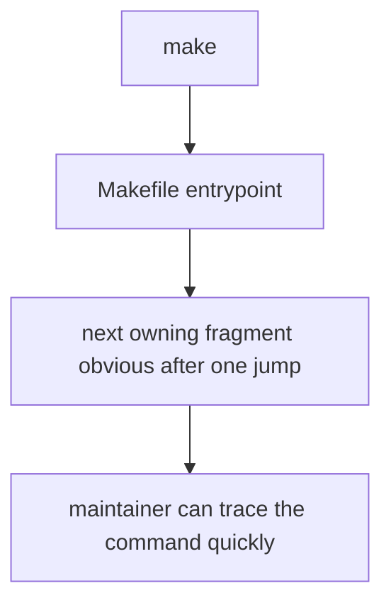
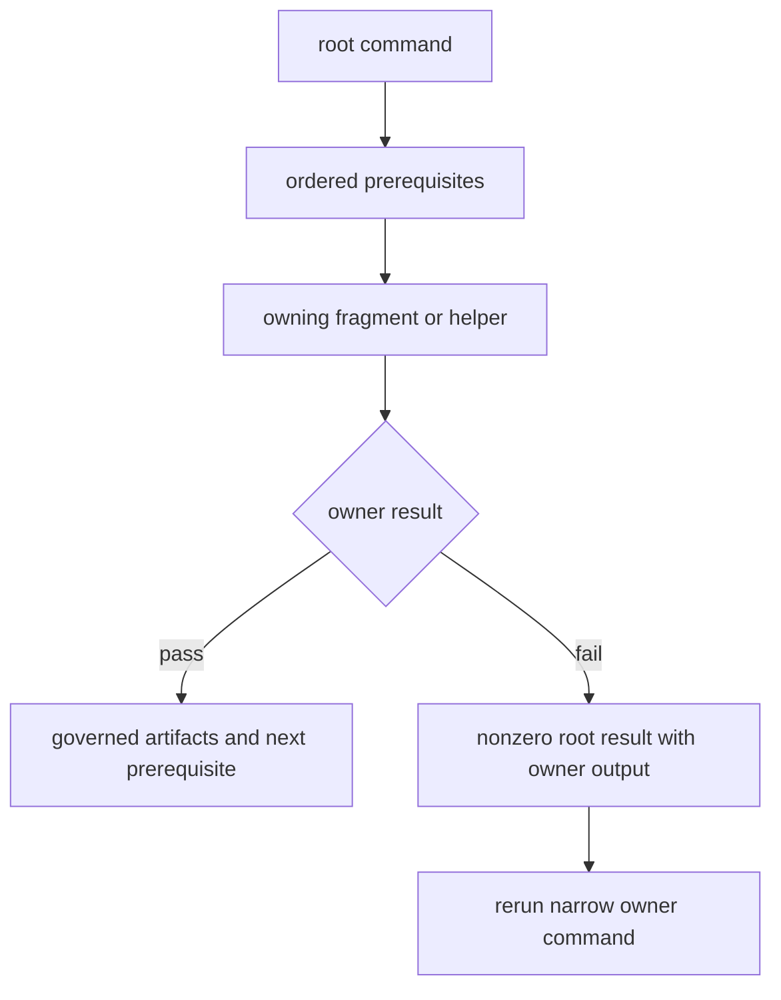

# Root Entrypoints

Root entrypoints are the stable commands used by maintainers and CI. The root
`Makefile` contains a single include of `makes/root.mk`; that file composes the
environment, package inventory, shared Python automation, repository policy,
documentation, standards, and release fragments.

## Entrypoint Model

The first jump is intentionally shallow. A root alias identifies prerequisites
or dispatch policy, while the owning fragment or Python helper contains the
implementation and tests.

## Entrypoint classes

| Class | Examples | Root responsibility | Owning depth |
| --- | --- | --- | --- |
| environment | `install`, `lock-check`, `root-check-env` | select the repository environment contract | shared environment fragments |
| package dispatch | `test`, `lint`, `quality`, `security`, `api`, `build`, `sbom` | select a capability group or `PACKAGE` | package inventory, profile, then shared recipe |
| documentation | `docs`, `docs-check`, `docs-serve` | prepare synchronized public sources | docs fragments and MkDocs configuration |
| repository invariant | `architecture-check`, `api-freeze`, `quality-artifact-governance` | name one cross-package policy | tested maintainer helper |
| composite | `check` | preserve required ordering and failure propagation | child targets remain individually callable |
| release | `release-preflight` | enter the exact release policy | release-governance owner and retained evidence |

## Failure and artifact contract

A composite target must not convert a child failure into success. Local run
products belong below `artifacts/`; a target that writes caches, reports, or
build products into package roots violates the root contract even when its
exit status is zero.

## Entry rules

- keep top-level aliases declarative and visible through `make help`;
- route shared behavior into named fragments rather than dense inline shell;
- make the next owning file obvious after one jump;
- preserve child exit status and aggregate package failures explicitly;
- keep event-specific CI mechanics out of the local command meaning.

## First proof route

Read `Makefile`, then `makes/root.mk`, then follow only the includes and
prerequisites used by the command under review. Confirm its help description,
package group, environment preparation, artifact destination, and failure
propagation against an actual narrow invocation.

## Design Pressure

The dangerous failure is a readable alias that jumps into an opaque composite
recipe. A short root file is valuable only when the route beyond it remains
equally inspectable.
