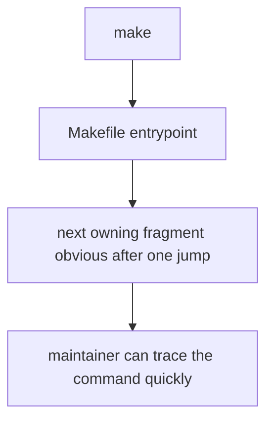

# Root Entrypoints

Root entrypoints are the command names maintainers and CI touch first. They should stay small, obvious, and easy to trace.

## Entrypoint Model

This page should make the root entrypoints feel intentionally shallow. A top-level target is only healthy when it points a maintainer toward the next owning file without detective work.

## Entry Rules

- keep top-level targets readable from `Makefile`
- route shared behavior into named fragments rather than inline shell complexity
- make the next owning file obvious after one jump

## First Proof Check

- `Makefile`
- `makes/root.mk`

## Design Pressure

The easy failure is to keep root targets readable at the command line while hiding too much of the real behavior behind one opaque jump.
