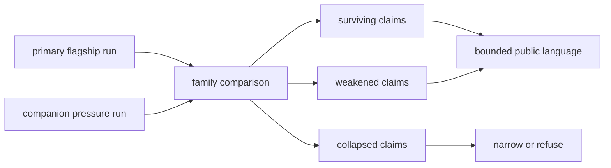

# Benchmark Comparability Matrix

This matrix tests whether a workflow-family statement survives both its primary flagship package and a companion package with a materially different pressure profile. It reports survival, weakening, and collapse separately so a stable aggregate score cannot conceal a failed claim.

## Family Comparison

| Workflow family | Public language | Primary run mode | Companion run mode | Stability score | Surviving claims | Weakened claims | Collapsed claims |
| --- | --- | --- | --- | --- | --- | --- | --- |
| `dda` | `outsider_auditable_bounded` | `import_only` | `import_only` | `0.83` | `1` | `1` | `0` |
| `dia` | `outsider_auditable_bounded` | `raw_executable` | `raw_executable` | `0.83` | `1` | `1` | `0` |
| `lfq` | `outsider_auditable_bounded` | `raw_executable` | `raw_executable` | `0.84` | `1` | `1` | `0` |
| `multiplex` | `internal_support_only` | `raw_executable` | `raw_executable` | `0.7` | `1` | `0` | `1` |
| `ptm` | `outsider_auditable_bounded` | `raw_executable` | `raw_executable` | `0.8` | `1` | `1` | `0` |
| `targeted` | `outsider_auditable_bounded` | `raw_executable` | `raw_executable` | `0.87` | `1` | `1` | `0` |

## Read The Matrix

- `surviving` means the declared claim remains supported in both packages under the recorded comparison policy;
- `weakened` means the direction survives but scope, certainty, or transfer language must narrow;
- `collapsed` means the companion evidence does not support the claim and release language must exclude it;
- the stability score summarizes the governed findings but never overrides a collapsed claim;
- run mode distinguishes native Runtime computation from custody of imported external-engine results.

## Family Notes

### `dda`

- primary package root: `packages/bijux-proteomics-core/benchmark-assets/flagship-public-packages/dda_reviewable_run`
- companion package root: `packages/bijux-proteomics-core/benchmark-assets/flagship-public-packages/dda_cross_engine_review_package`
- generalization report: `packages/bijux-proteomics-core/benchmark-assets/flagship-public-packages/dda_cross_engine_review_package/cross_package_generalization.json`
- stability label: `highly_stable`

- Compare the primary MaxQuant import path against the paired MSFragger comparator export inside the tracked DDA package.
- Preserve target-decoy visibility and explicit protein-rollup caution rather than flattening DDA review into engine-agnostic certainty.
- This report is the public family-transfer surface. It records what still survives when the workflow moves from the flagship primary package to a second package with a materially different pressure profile.

### `dia`

- primary package root: `packages/bijux-proteomics-core/benchmark-assets/flagship-public-packages/dia_library_review_package`
- companion package root: `packages/bijux-proteomics-core/benchmark-assets/flagship-public-packages/dia_matrix_shift_review_package`
- generalization report: `packages/bijux-proteomics-core/benchmark-assets/flagship-public-packages/dia_matrix_shift_review_package/cross_package_generalization.json`
- stability label: `highly_stable`

- Compare adapter-normalized outputs against the tracked DIA public package because direct DIA-NN or Spectronaut execution is outside repo scope.
- Keep SWATH-style transition semantics aligned with the published DIA method reference.
- This report is the public family-transfer surface. It records what still survives when the workflow moves from the flagship primary package to a second package with a materially different pressure profile.

### `lfq`

- primary package root: `packages/bijux-proteomics-core/benchmark-assets/flagship-public-packages/lfq_cohort_review_package`
- companion package root: `packages/bijux-proteomics-core/benchmark-assets/flagship-public-packages/lfq_sparse_contrast_review_package`
- generalization report: `packages/bijux-proteomics-core/benchmark-assets/flagship-public-packages/lfq_sparse_contrast_review_package/cross_package_generalization.json`
- stability label: `highly_stable`

- Compare rollups against the tracked LFQ public package instead of claiming parity with unexecuted external quantification pipelines.
- Keep support claims scoped to repeatable abundance aggregation and design preservation.
- This report is the public family-transfer surface. It records what still survives when the workflow moves from the flagship primary package to a second package with a materially different pressure profile.

### `multiplex`

- primary package root: `packages/bijux-proteomics-core/benchmark-assets/flagship-public-packages/multiplex_tmtpro_review_package`
- companion package root: `packages/bijux-proteomics-core/benchmark-assets/flagship-public-packages/multiplex_channel_stress_review_package`
- generalization report: `packages/bijux-proteomics-core/benchmark-assets/flagship-public-packages/multiplex_channel_stress_review_package/cross_package_generalization.json`
- stability label: `fragile_transfer`

- Compare reporter handling against the tracked multiplex public package because direct vendor-specific multiplex pipelines are not executed here.
- Limit support claims to channel semantics and chemistry caveats, not full external pipeline parity.
- This report is the public family-transfer surface. It records what still survives when the workflow moves from the flagship primary package to a second package with a materially different pressure profile.

### `ptm`

- primary package root: `packages/bijux-proteomics-core/benchmark-assets/flagship-public-packages/ptm_localization_review_package`
- companion package root: `packages/bijux-proteomics-core/benchmark-assets/flagship-public-packages/ptm_ambiguity_stress_review_package`
- generalization report: `packages/bijux-proteomics-core/benchmark-assets/flagship-public-packages/ptm_ambiguity_stress_review_package/cross_package_generalization.json`
- stability label: `highly_stable`

- Compare localization handling against the checked-in PTM localization fixture because direct rescoring engines are not executed in the repo test path.
- Retain Ascore-style ambiguity framing and PSI-MOD grounding in the resulting claims.
- This report is the public family-transfer surface. It records what still survives when the workflow moves from the flagship primary package to a second package with a materially different pressure profile.

### `targeted`

- primary package root: `packages/bijux-proteomics-core/benchmark-assets/flagship-public-packages/targeted_transition_review_package`
- companion package root: `packages/bijux-proteomics-core/benchmark-assets/flagship-public-packages/targeted_carryover_review_package`
- generalization report: `packages/bijux-proteomics-core/benchmark-assets/flagship-public-packages/targeted_carryover_review_package/cross_package_generalization.json`
- stability label: `highly_stable`

- Compare targeted QC handling against the tracked targeted public package and published protein-inference caution rather than claiming direct vendor chromatogram parity.
- Keep support claims scoped to transition-level evidence retention and cautious rollup semantics.
- This report is the public family-transfer surface. It records what still survives when the workflow moves from the flagship primary package to a second package with a materially different pressure profile.

## Decision Rule

A family may keep only the language that survives its primary and companion packages, their declared comparison policy, and all visible collapsed findings. Evidence from another family cannot repair a failure here.
