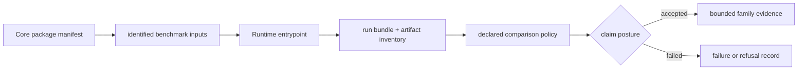

# Benchmark Rerun Kits

A benchmark rerun kit connects three independently reviewable things: a
governed Core asset, a public Runtime entrypoint, and a recorded result bundle.
The connection matters more than any one file. A manifest without execution is
an inspectable corpus; an execution without a manifest is an unattributed run;
a run bundle without comparison policy cannot support a parity claim.

## Family Rerun Routes

All paths below are importable Python entrypoints in
`bijux_proteomics_runtime.workflows`. The primary runtime entrypoint reopens the
flagship package. The companion runtime entrypoint applies transfer or stress
pressure from a distinct governed package.

| Family | Primary benchmark package | Primary runtime entrypoint | Companion benchmark package | Companion runtime entrypoint | Primary run mode |
| --- | --- | --- | --- | --- | --- |
| `dda` | `dda_reviewable_run` | `paths.run_reviewable_import_path` | `dda_cross_engine_review_package` | `benchmark_runs.run_benchmark_dda_generalization_import_path` | `import_only` |
| `dia` | `dia_library_review_package` | `benchmark_runs.run_benchmark_dia_review_path` | `dia_matrix_shift_review_package` | `benchmark_runs.run_benchmark_dia_generalization_review_path` | `raw_executable` over checked exports |
| `lfq` | `lfq_cohort_review_package` | `benchmark_runs.run_benchmark_lfq_review_path` | `lfq_sparse_contrast_review_package` | `benchmark_runs.run_benchmark_lfq_generalization_review_path` | `raw_executable` over checked features |
| `multiplex` | `multiplex_tmtpro_review_package` | `benchmark_runs.run_benchmark_multiplex_review_path` | `multiplex_channel_stress_review_package` | `benchmark_runs.run_benchmark_multiplex_generalization_review_path` | `raw_executable` over checked features |
| `ptm` | `ptm_localization_review_package` | `benchmark_runs.run_benchmark_ptm_review_path` | `ptm_ambiguity_stress_review_package` | `benchmark_runs.run_benchmark_ptm_generalization_review_path` | `raw_executable` over checked localization inputs |
| `targeted` | `targeted_transition_review_package` | `benchmark_runs.run_benchmark_targeted_review_path` | `targeted_carryover_review_package` | `benchmark_runs.run_benchmark_targeted_generalization_review_path` | `raw_executable` over checked targeted QC |

If a future package has no governed companion lane, its table entry must say
`not published for this family`; a primary rerun must never be presented as
generalization evidence by implication.

The DDA primary route is deliberately different. It imports a checked MaxQuant
result rather than running an in-repository search engine. The companion route
imports a distinct Comet/Sage comparison package, which adds cross-engine
pressure without turning imported execution into a native search claim.

## Open A Kit

From a clean checkout and installed workspace environment:

1. open the package `package_manifest.json` and identify its scientific family,
   source locator, expected inventory, and declared run mode;
2. verify the files named by `artifact_inventory.json` and their checksums;
3. call the family’s primary entrypoint and write its result below
   `artifacts/bijux-proteomics-runtime/`;
4. preserve the resolved configuration, input identities, provider, terminal
   state, diagnostics, and output hashes;
5. call the companion entrypoint independently;
6. compare the two results only under the rule published in the
   [Benchmark Comparability Matrix](benchmark-comparability-matrix.md);
7. inspect the family refusal before writing a stronger claim.

Do not overwrite the tracked fixture under
`packages/bijux-proteomics-runtime/tests/fixtures/flagship_runs/` during a
local review. That fixture is governed test evidence; the new run belongs under
`artifacts/` until its promotion is explicitly reviewed.

## Read The Result Bundle

| Evidence | Question it answers | Question it cannot answer alone |
| --- | --- | --- |
| benchmark manifest | which corpus and family contract were requested? | did execution complete? |
| runtime state history | which states and refusals occurred? | are the scientific outputs acceptable? |
| artifact inventory and hashes | which outputs were produced without substitution? | are two outputs scientifically equivalent? |
| environment record | which provider and dependencies shaped execution? | will another environment behave identically? |
| comparison report | which declared fields remained stable? | does the result generalize outside the corpus? |
| Core acceptance result | did the output meet family-specific bars? | is the biological interpretation grounded? |

The [Black-Box Benchmark Dashboard](black-box-benchmark-dashboard.md) summarizes
these checks for installed public entrypoints. The
[Flagship Run Registry](flagship-run-registry.md) binds published run identities
to their artifacts. Neither surface replaces the underlying bundle.

## Current Claim Ceilings

| Family | Strongest runtime statement | Limiter that remains visible |
| --- | --- | --- |
| `dda` | the shipped imported-result lane and cross-engine companion can be reopened | no raw DDA search execution lane is owned in-repository |
| `dia` | checked DIA reports can be executed through the published Runtime lane | chromatogram-native replay and broad vendor parity are not established |
| `lfq` | primary and sparse-cohort feature tables can be rerun and compared | missingness and cohort transfer still bound generality |
| `multiplex` | primary and channel-stress inputs have executable lanes | the stress evidence does not support outsider-auditable language |
| `ptm` | primary and ambiguity-stress localization inputs can be rerun | localization strength does not establish downstream consequence confidence |
| `targeted` | transition and carryover packages can be rerun | calibration, interference, and laboratory burden remain limiting |

Runtime completion proves operational execution under the recorded inputs and
environment. It does not prove source authenticity, scientific acceptance,
grounded biological truth, recommendation authority, or laboratory value.

## Continue The Audit

- [Runtime Execution Boundary](runtime-execution-boundary.md) gives the exact
  manifest, entrypoint, fixture, and refusal for every primary family lane.
- [Runtime Replay Challenges](runtime-replay-challenges.md) applies state,
  environment, and artifact perturbations.
- [Raw Versus Import Execution](raw-versus-import-execution.md) distinguishes
  native computation from custody of external results.
- [Runtime Rerun Refusals](runtime-rerun-refusals.md) states the evidence needed
  before each claim can widen.
- [Benchmark Assets](../04-bijux-proteomics-core/foundation/benchmark-assets.md)
  covers provenance, redistribution, freshness, and incompleteness.
