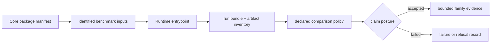

# Benchmark Rerun Kits

A benchmark rerun kit connects three independently reviewable things: a governed Core asset, a public Runtime entrypoint, and a recorded result bundle. A manifest without execution is only an inspectable corpus; an execution without a manifest is an unattributed run; a run bundle without comparison policy cannot support a parity claim.

## Family Rerun Routes

All entrypoints below are importable from `bijux_proteomics_runtime.workflows`. The primary lane reopens the flagship package; the companion lane applies transfer or stress pressure from a distinct governed package.

| Family | Primary package | Primary entrypoint | Primary mode | Companion package | Companion entrypoint | Companion mode |
| --- | --- | --- | --- | --- | --- | --- |
| `dda` | `dda_reviewable_run` | `paths.run_reviewable_import_path` | `import_only` | `dda_cross_engine_review_package` | `benchmark_runs.run_benchmark_dda_generalization_import_path` | `import_only` |
| `dia` | `dia_library_review_package` | `benchmark_runs.run_benchmark_dia_review_path` | `raw_executable` | `dia_matrix_shift_review_package` | `benchmark_runs.run_benchmark_dia_generalization_review_path` | `raw_executable` |
| `lfq` | `lfq_cohort_review_package` | `benchmark_runs.run_benchmark_lfq_review_path` | `raw_executable` | `lfq_sparse_contrast_review_package` | `benchmark_runs.run_benchmark_lfq_generalization_review_path` | `raw_executable` |
| `multiplex` | `multiplex_tmtpro_review_package` | `benchmark_runs.run_benchmark_multiplex_review_path` | `raw_executable` | `multiplex_channel_stress_review_package` | `benchmark_runs.run_benchmark_multiplex_generalization_review_path` | `raw_executable` |
| `ptm` | `ptm_localization_review_package` | `benchmark_runs.run_benchmark_ptm_review_path` | `raw_executable` | `ptm_ambiguity_stress_review_package` | `benchmark_runs.run_benchmark_ptm_generalization_review_path` | `raw_executable` |
| `targeted` | `targeted_transition_review_package` | `benchmark_runs.run_benchmark_targeted_review_path` | `raw_executable` | `targeted_carryover_review_package` | `benchmark_runs.run_benchmark_targeted_generalization_review_path` | `raw_executable` |

If a future family has no governed companion lane, its entry must say `not published for this family`; a primary rerun must never imply generalization evidence.

DDA is deliberately different from the other lanes. Its primary route imports a checked MaxQuant result rather than running an in-repository search engine. Its companion imports a distinct Comet/Sage comparison package, adding cross-engine pressure without turning imported execution into a native-search claim.

## Open A Kit

From a clean checkout and installed workspace environment:

1. Open the package `package_manifest.json` and identify its scientific family, source locator, expected inventory, and declared run mode.
2. Verify the files named by `artifact_inventory.json` and their checksums.
3. Call the family's primary entrypoint and write its result below `artifacts/bijux-proteomics-runtime/`.
4. Preserve the resolved configuration, input identities, provider, terminal state, diagnostics, and output hashes.
5. Call the companion entrypoint independently.
6. Compare the results only under the rule in the [Benchmark Comparability Matrix](benchmark-comparability-matrix.md).
7. Inspect the family refusal before writing a stronger claim.

Do not overwrite tracked fixtures beneath `packages/bijux-proteomics-runtime/tests/fixtures/flagship_runs/`. They are governed test evidence; a new run remains under `artifacts/` until promotion is explicitly reviewed.

## Family Evidence

### `dda`

- public release language: `outsider_auditable_bounded`
- primary package root: `packages/bijux-proteomics-core/benchmark-assets/flagship-public-packages/dda_reviewable_run`
- companion package root: `packages/bijux-proteomics-core/benchmark-assets/flagship-public-packages/dda_cross_engine_review_package`
- primary runtime entrypoint: `bijux_proteomics_runtime.workflows.paths.run_reviewable_import_path`
- primary run mode: `import_only`
- companion runtime entrypoint: `bijux_proteomics_runtime.workflows.benchmark_runs.run_benchmark_dda_generalization_import_path`
- companion run mode: `import_only`

Opening order:

- `packages/bijux-proteomics-core/benchmark-assets/flagship-public-packages/dda_reviewable_run/package_manifest.json`
- `packages/bijux-proteomics-core/benchmark-assets/flagship-public-packages/dda_reviewable_run/artifact_inventory.json`
- `packages/bijux-proteomics-core/tests/fixtures/search_adapter_corpora/maxquant/maxquant_pipeline_export.tsv`
- `packages/bijux-proteomics-core/benchmark-assets/flagship-public-packages/dda_cross_engine_review_package/package_manifest.json`
- `packages/bijux-proteomics-core/benchmark-assets/flagship-public-packages/dda_cross_engine_review_package/artifact_inventory.json`
- `packages/bijux-proteomics-core/benchmark-assets/flagship-public-packages/dda_cross_engine_review_package/primary/comet_pipeline_export.tsv`
- `artifacts/intelligence/independent-reruns/dda_independent_rerun_dossier.json`
- `artifacts/intelligence/external-review-kits/dda_external_review_kit.json`

Validating tests:

- `packages/bijux-proteomics-runtime/tests/workflows/test_runtime_external_pack_surface.py`
- `packages/bijux-proteomics-runtime/tests/workflows/test_benchmark_runtime_surface.py`

- independent rerun dossier: `artifacts/intelligence/independent-reruns/dda_independent_rerun_dossier.json`
- external review kit: `artifacts/intelligence/external-review-kits/dda_external_review_kit.json`

Remaining limits:

- no in-repo live-engine rerun parity
- one-run package cannot authorize broad production-cohort DDA claims
- no live-engine rerun parity
- generalization remains bounded to two small exported-result packages
- The dossier still describes repository-owned rerun lanes, not an untracked third-party reproduction outside the repository boundary.
- The strongest shipped rerun lane is still import-backed rather than a raw external-engine execution owned by this repository.

Open the primary package first, then the companion package, then the rerun dossier or external review kit if one exists. The kit is meant to survive without maintainer narration.

### `dia`

- public release language: `outsider_auditable_bounded`
- primary package root: `packages/bijux-proteomics-core/benchmark-assets/flagship-public-packages/dia_library_review_package`
- companion package root: `packages/bijux-proteomics-core/benchmark-assets/flagship-public-packages/dia_matrix_shift_review_package`
- primary runtime entrypoint: `bijux_proteomics_runtime.workflows.benchmark_runs.run_benchmark_dia_review_path`
- primary run mode: `raw_executable`
- companion runtime entrypoint: `bijux_proteomics_runtime.workflows.benchmark_runs.run_benchmark_dia_generalization_review_path`
- companion run mode: `raw_executable`

Opening order:

- `packages/bijux-proteomics-core/benchmark-assets/flagship-public-packages/dia_library_review_package/package_manifest.json`
- `packages/bijux-proteomics-core/benchmark-assets/flagship-public-packages/dia_library_review_package/artifact_inventory.json`
- `packages/bijux-proteomics-core/benchmark-assets/flagship-public-packages/dia_library_review_package/primary/spectronaut_report.tsv`
- `packages/bijux-proteomics-core/benchmark-assets/flagship-public-packages/dia_matrix_shift_review_package/package_manifest.json`
- `packages/bijux-proteomics-core/benchmark-assets/flagship-public-packages/dia_matrix_shift_review_package/artifact_inventory.json`
- `packages/bijux-proteomics-core/benchmark-assets/flagship-public-packages/dia_matrix_shift_review_package/primary/diann_report.tsv`
- `artifacts/intelligence/independent-reruns/dia_independent_rerun_dossier.json`
- `artifacts/intelligence/external-review-kits/dia_external_review_kit.json`

Validating tests:

- `packages/bijux-proteomics-runtime/tests/workflows/test_runtime_external_pack_surface.py`
- `packages/bijux-proteomics-runtime/tests/workflows/test_benchmark_runtime_surface.py`

- independent rerun dossier: `artifacts/intelligence/independent-reruns/dia_independent_rerun_dossier.json`
- external review kit: `artifacts/intelligence/external-review-kits/dia_external_review_kit.json`

Remaining limits:

- no chromatogram-level vendor parity
- library incompleteness and absent-peptide consequences still block broader biological confidence
- protein-evidence transfer remains weaker than precursor-level review transfer
- library-conditioned authority still caps the family posture
- The dossier still describes repository-owned rerun lanes, not an untracked third-party reproduction outside the repository boundary.
- The strongest shipped rerun lane is raw-executable inside the repository, but vendor-parity and broader ecosystem replay are still separate questions.

Open the primary package first, then the companion package, then the rerun dossier or external review kit if one exists. The kit is meant to survive without maintainer narration.

### `lfq`

- public release language: `outsider_auditable_bounded`
- primary package root: `packages/bijux-proteomics-core/benchmark-assets/flagship-public-packages/lfq_cohort_review_package`
- companion package root: `packages/bijux-proteomics-core/benchmark-assets/flagship-public-packages/lfq_sparse_contrast_review_package`
- primary runtime entrypoint: `bijux_proteomics_runtime.workflows.benchmark_runs.run_benchmark_lfq_review_path`
- primary run mode: `raw_executable`
- companion runtime entrypoint: `bijux_proteomics_runtime.workflows.benchmark_runs.run_benchmark_lfq_generalization_review_path`
- companion run mode: `raw_executable`

Opening order:

- `packages/bijux-proteomics-core/benchmark-assets/flagship-public-packages/lfq_cohort_review_package/package_manifest.json`
- `packages/bijux-proteomics-core/benchmark-assets/flagship-public-packages/lfq_cohort_review_package/artifact_inventory.json`
- `packages/bijux-proteomics-core/benchmark-assets/flagship-public-packages/lfq_cohort_review_package/evidence/study_scale_ms1_features.tsv`
- `packages/bijux-proteomics-core/benchmark-assets/flagship-public-packages/lfq_sparse_contrast_review_package/package_manifest.json`
- `packages/bijux-proteomics-core/benchmark-assets/flagship-public-packages/lfq_sparse_contrast_review_package/artifact_inventory.json`
- `packages/bijux-proteomics-core/benchmark-assets/flagship-public-packages/lfq_sparse_contrast_review_package/evidence/edge_case_ms1_features.tsv`
- `artifacts/intelligence/independent-reruns/lfq_independent_rerun_dossier.json`
- `artifacts/intelligence/external-review-kits/lfq_external_review_kit.json`

Validating tests:

- `packages/bijux-proteomics-runtime/tests/workflows/test_flagship_run_bundle_surface.py`
- `packages/bijux-proteomics-runtime/tests/workflows/test_benchmark_runtime_surface.py`

- independent rerun dossier: `artifacts/intelligence/independent-reruns/lfq_independent_rerun_dossier.json`
- external review kit: `artifacts/intelligence/external-review-kits/lfq_external_review_kit.json`

Remaining limits:

- no stronger public truth package for accuracy beyond repeatability
- generalization beyond the current cohort package remains explicitly bounded
- effect-direction confidence weakens under sparser contrast
- family authority remains bounded rather than decision-grade
- The dossier still describes repository-owned rerun lanes, not an untracked third-party reproduction outside the repository boundary.
- The strongest shipped rerun lane is raw-executable inside the repository, but vendor-parity and broader ecosystem replay are still separate questions.

Open the primary package first, then the companion package, then the rerun dossier or external review kit if one exists. The kit is meant to survive without maintainer narration.

### `multiplex`

- public release language: `internal_support_only`
- primary package root: `packages/bijux-proteomics-core/benchmark-assets/flagship-public-packages/multiplex_tmtpro_review_package`
- companion package root: `packages/bijux-proteomics-core/benchmark-assets/flagship-public-packages/multiplex_channel_stress_review_package`
- primary runtime entrypoint: `bijux_proteomics_runtime.workflows.benchmark_runs.run_benchmark_multiplex_review_path`
- primary run mode: `raw_executable`
- companion runtime entrypoint: `bijux_proteomics_runtime.workflows.benchmark_runs.run_benchmark_multiplex_generalization_review_path`
- companion run mode: `raw_executable`

Opening order:

- `packages/bijux-proteomics-core/benchmark-assets/flagship-public-packages/multiplex_tmtpro_review_package/package_manifest.json`
- `packages/bijux-proteomics-core/benchmark-assets/flagship-public-packages/multiplex_tmtpro_review_package/artifact_inventory.json`
- `packages/bijux-proteomics-core/benchmark-assets/flagship-public-packages/multiplex_tmtpro_review_package/evidence/multiplex_ms1_features.tsv`
- `packages/bijux-proteomics-core/benchmark-assets/flagship-public-packages/multiplex_channel_stress_review_package/package_manifest.json`
- `packages/bijux-proteomics-core/benchmark-assets/flagship-public-packages/multiplex_channel_stress_review_package/artifact_inventory.json`
- `packages/bijux-proteomics-core/benchmark-assets/flagship-public-packages/multiplex_channel_stress_review_package/evidence/multiplex_channel_stress_ms1_features.tsv`

Validating tests:

- `packages/bijux-proteomics-runtime/tests/workflows/test_flagship_run_bundle_surface.py`
- `packages/bijux-proteomics-runtime/tests/workflows/test_benchmark_runtime_surface.py`

- independent rerun dossier: `not published for this family`
- external review kit: `not published for this family`

Remaining limits:

- no multiplex lab packet or outsider decision brief family
- multiplex authority is intentionally kept out of the outsider-facing flagship set
- multiplex still lacks outsider review and lab consequence posture
- public release language remains internal-support only even with a second package
- Multiplex remains internal-support only, so the rerun kit is reviewable but not a route to outsider-auditable language.

Open the primary package first, then the companion package, then the rerun dossier or external review kit if one exists. The kit is meant to survive without maintainer narration.

### `ptm`

- public release language: `outsider_auditable_bounded`
- primary package root: `packages/bijux-proteomics-core/benchmark-assets/flagship-public-packages/ptm_localization_review_package`
- companion package root: `packages/bijux-proteomics-core/benchmark-assets/flagship-public-packages/ptm_ambiguity_stress_review_package`
- primary runtime entrypoint: `bijux_proteomics_runtime.workflows.benchmark_runs.run_benchmark_ptm_review_path`
- primary run mode: `raw_executable`
- companion runtime entrypoint: `bijux_proteomics_runtime.workflows.benchmark_runs.run_benchmark_ptm_generalization_review_path`
- companion run mode: `raw_executable`

Opening order:

- `packages/bijux-proteomics-core/benchmark-assets/flagship-public-packages/ptm_localization_review_package/package_manifest.json`
- `packages/bijux-proteomics-core/benchmark-assets/flagship-public-packages/ptm_localization_review_package/artifact_inventory.json`
- `packages/bijux-proteomics-core/benchmark-assets/flagship-public-packages/ptm_localization_review_package/evidence/localization_results.tsv`
- `packages/bijux-proteomics-core/benchmark-assets/flagship-public-packages/ptm_ambiguity_stress_review_package/package_manifest.json`
- `packages/bijux-proteomics-core/benchmark-assets/flagship-public-packages/ptm_ambiguity_stress_review_package/artifact_inventory.json`
- `packages/bijux-proteomics-core/benchmark-assets/flagship-public-packages/ptm_ambiguity_stress_review_package/evidence/localization_results.tsv`
- `artifacts/intelligence/independent-reruns/ptm_independent_rerun_dossier.json`
- `artifacts/intelligence/external-review-kits/ptm_external_review_kit.json`

Validating tests:

- `packages/bijux-proteomics-runtime/tests/workflows/test_flagship_run_bundle_surface.py`
- `packages/bijux-proteomics-runtime/tests/workflows/test_benchmark_runtime_surface.py`

- independent rerun dossier: `artifacts/intelligence/independent-reruns/ptm_independent_rerun_dossier.json`
- external review kit: `artifacts/intelligence/external-review-kits/ptm_external_review_kit.json`

Remaining limits:

- occupancy and regulatory interpretation still remain narrower than localization evidence
- PTM follow-up remains exploratory and bounded by ambiguity-aware consequence planning
- targetability weakens materially under ambiguity stress
- family authority remains bounded rather than decision-grade
- The dossier still describes repository-owned rerun lanes, not an untracked third-party reproduction outside the repository boundary.
- The strongest shipped rerun lane is raw-executable inside the repository, but vendor-parity and broader ecosystem replay are still separate questions.

Open the primary package first, then the companion package, then the rerun dossier or external review kit if one exists. The kit is meant to survive without maintainer narration.

### `targeted`

- public release language: `outsider_auditable_bounded`
- primary package root: `packages/bijux-proteomics-core/benchmark-assets/flagship-public-packages/targeted_transition_review_package`
- companion package root: `packages/bijux-proteomics-core/benchmark-assets/flagship-public-packages/targeted_carryover_review_package`
- primary runtime entrypoint: `bijux_proteomics_runtime.workflows.benchmark_runs.run_benchmark_targeted_review_path`
- primary run mode: `raw_executable`
- companion runtime entrypoint: `bijux_proteomics_runtime.workflows.benchmark_runs.run_benchmark_targeted_generalization_review_path`
- companion run mode: `raw_executable`

Opening order:

- `packages/bijux-proteomics-core/benchmark-assets/flagship-public-packages/targeted_transition_review_package/package_manifest.json`
- `packages/bijux-proteomics-core/benchmark-assets/flagship-public-packages/targeted_transition_review_package/artifact_inventory.json`
- `packages/bijux-proteomics-core/benchmark-assets/flagship-public-packages/targeted_transition_review_package/evidence/targeted_benchmark_qc.tsv`
- `packages/bijux-proteomics-core/benchmark-assets/flagship-public-packages/targeted_carryover_review_package/package_manifest.json`
- `packages/bijux-proteomics-core/benchmark-assets/flagship-public-packages/targeted_carryover_review_package/artifact_inventory.json`
- `packages/bijux-proteomics-core/benchmark-assets/flagship-public-packages/targeted_carryover_review_package/evidence/targeted_benchmark_qc.tsv`
- `artifacts/intelligence/independent-reruns/targeted_independent_rerun_dossier.json`
- `artifacts/intelligence/external-review-kits/targeted_external_review_kit.json`

Validating tests:

- `packages/bijux-proteomics-runtime/tests/workflows/test_flagship_run_bundle_surface.py`
- `packages/bijux-proteomics-runtime/tests/workflows/test_benchmark_runtime_surface.py`

- independent rerun dossier: `artifacts/intelligence/independent-reruns/targeted_independent_rerun_dossier.json`
- external review kit: `artifacts/intelligence/external-review-kits/targeted_external_review_kit.json`

Remaining limits:

- vendor-parity and calibration-clean authority are still outside the current proof boundary
- targeted follow-up remains exploratory and cannot authorize calibration-perfect biological certainty
- stronger carryover pressure weakens promotion confidence
- family authority remains bounded by calibration and vendor-parity limits
- The dossier still describes repository-owned rerun lanes, not an untracked third-party reproduction outside the repository boundary.
- The strongest shipped rerun lane is raw-executable inside the repository, but vendor-parity and broader ecosystem replay are still separate questions.

Open the primary package first, then the companion package, then the rerun dossier or external review kit if one exists. The kit is meant to survive without maintainer narration.

## Read The Result Bundle

| Evidence | Question it answers | Question it cannot answer alone |
| --- | --- | --- |
| benchmark manifest | which corpus and family contract were requested? | did execution complete? |
| runtime state history | which states and refusals occurred? | are the scientific outputs acceptable? |
| artifact inventory and hashes | which outputs were produced without substitution? | are two outputs scientifically equivalent? |
| environment record | which provider and dependencies shaped execution? | will another environment behave identically? |
| comparison report | which declared fields remained stable? | does the result generalize outside the corpus? |
| Core acceptance result | did the output meet family-specific bars? | is the biological interpretation grounded? |

The [Black-Box Benchmark Dashboard](black-box-benchmark-dashboard.md) summarizes installed-entrypoint checks. The [Flagship Run Registry](flagship-run-registry.md) binds published run identities to artifacts. Neither replaces the underlying bundle.

## Current Claim Ceilings

| Family | Primary mode | Public language | Limits that remain visible |
| --- | --- | --- | --- |
| `dda` | `import_only` | `outsider_auditable_bounded` | no in-repo live-engine rerun parity; one-run package cannot authorize broad production-cohort DDA claims |
| `dia` | `raw_executable` | `outsider_auditable_bounded` | no chromatogram-level vendor parity; library incompleteness and absent-peptide consequences still block broader biological confidence |
| `lfq` | `raw_executable` | `outsider_auditable_bounded` | no stronger public truth package for accuracy beyond repeatability; generalization beyond the current cohort package remains explicitly bounded |
| `multiplex` | `raw_executable` | `internal_support_only` | no multiplex lab packet or outsider decision brief family; multiplex authority is intentionally kept out of the outsider-facing flagship set |
| `ptm` | `raw_executable` | `outsider_auditable_bounded` | occupancy and regulatory interpretation still remain narrower than localization evidence; PTM follow-up remains exploratory and bounded by ambiguity-aware consequence planning |
| `targeted` | `raw_executable` | `outsider_auditable_bounded` | vendor-parity and calibration-clean authority are still outside the current proof boundary; targeted follow-up remains exploratory and cannot authorize calibration-perfect biological certainty |

Runtime completion proves operational execution under recorded inputs and environment. It does not prove source authenticity, scientific acceptance, grounded biological truth, recommendation authority, or laboratory value.

## Continue The Audit

- [Runtime Execution Boundary](runtime-execution-boundary.md) gives the manifest, entrypoint, fixture, and refusal for every primary lane.
- [Runtime Replay Challenges](runtime-replay-challenges.md) applies state, environment, and artifact perturbations.
- [Raw Versus Import Execution](raw-versus-import-execution.md) distinguishes native computation from custody of external results.
- [Runtime Rerun Refusals](runtime-rerun-refusals.md) states the evidence needed before each claim can widen.
- [Benchmark Assets](../04-bijux-proteomics-core/foundation/benchmark-assets.md) covers provenance, redistribution, freshness, and incompleteness.
