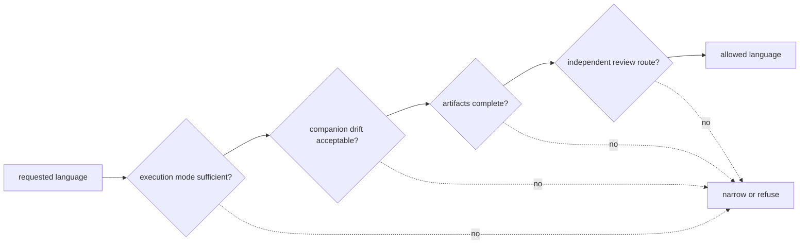

# Black-Box Benchmark Dashboard

This dashboard states what installed Runtime entrypoints and public benchmark evidence can defend without maintainer narration. Requested language is only an input; allowed language is the ceiling after execution mode, drift, artifact completeness, independent rerun evidence, and family blockers are applied.

## Workflow Dashboard

| Workflow family | Requested language | Allowed language | Primary run mode | Companion run mode | Drift status | Artifact completeness |
| --- | --- | --- | --- | --- | --- | --- |
| `dda` | `outsider_auditable_bounded` | `review_grade_bounded` | `import_only` | `import_only` | `highly_stable` | `complete` |
| `dia` | `outsider_auditable_bounded` | `outsider_auditable_bounded` | `raw_executable` | `raw_executable` | `highly_stable` | `complete` |
| `lfq` | `outsider_auditable_bounded` | `outsider_auditable_bounded` | `raw_executable` | `raw_executable` | `highly_stable` | `complete` |
| `multiplex` | `internal_support_only` | `internal_support_only` | `raw_executable` | `raw_executable` | `fragile_transfer` | `complete` |
| `ptm` | `outsider_auditable_bounded` | `outsider_auditable_bounded` | `raw_executable` | `raw_executable` | `highly_stable` | `complete` |
| `targeted` | `outsider_auditable_bounded` | `outsider_auditable_bounded` | `raw_executable` | `raw_executable` | `highly_stable` | `complete` |

## Read The Columns

`requested language` records the upstream workflow claim. `allowed language` is the black-box ceiling and may only remain equal or become narrower. `import_only` identifies custody and validation of external-engine output; it is not native search execution. Drift and completeness describe the checked companion comparison and governed asset inventory, not universal platform behavior.

## Remaining Independent-Rerun Blockers

### `dda`

- primary flagship lane is still not raw-executable in the runtime layer
- companion generalization lane is still not raw-executable in the runtime layer
- no in-repo live-engine rerun parity
- one-run package cannot authorize broad production-cohort DDA claims

### `dia`

- no chromatogram-level vendor parity
- library incompleteness and absent-peptide consequences still block broader biological confidence

### `lfq`

- no stronger public truth package for accuracy beyond repeatability
- generalization beyond the current cohort package remains explicitly bounded

### `multiplex`

- 1 cross-package claim(s) collapse under the companion rerun path
- no multiplex lab packet or outsider decision brief family
- multiplex authority is intentionally kept out of the outsider-facing flagship set

### `ptm`

- occupancy and regulatory interpretation still remain narrower than localization evidence
- PTM follow-up remains exploratory and bounded by ambiguity-aware consequence planning

### `targeted`

- vendor-parity and calibration-clean authority are still outside the current proof boundary
- targeted follow-up remains exploratory and cannot authorize calibration-perfect biological certainty

## Release Rule

A public sentence must not exceed `allowed language`. Any missing artifact, collapsed comparison, absent rerun route, or stronger execution request remains a release blocker until new governed evidence changes the dashboard.

## Continue The Review

- Open [Workflow Families](../01-bijux-proteomics/foundation/workflow-families.md) to identify the proposed family-level sentence and its authority ceiling.
- Open [Benchmark Assets](../04-bijux-proteomics-core/foundation/benchmark-assets.md) to inspect provenance, redistribution, freshness, and incompleteness.
- Open [Decision Support](../01-bijux-proteomics/foundation/decision-support.md) to follow accepted evidence into recommendation, refusal, and laboratory consequence.
