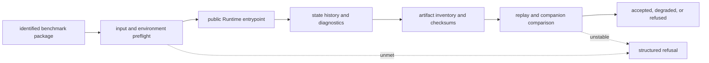

# Execution

Execution turns an identified public benchmark package into a run bundle that
can be rerun, compared, refused, and inspected without private operational
knowledge.

`bijux-proteomics-runtime` owns this route because runtime proof is not only a
CLI matter anymore. It now includes run-mode honesty, replay, rerun kits,
artifact integrity, refusal boundaries, and explicit limits on what execution
can and cannot prove.

## What Execution Means Here

Execution evidence is narrower than scientific truth and stronger than a
convenient demo:

- it proves what can be rerun or replayed from the current public package set
- it proves which artifacts, checks, and refusal boundaries still survive
  without private maintainer glue
- it does not by itself widen scientific meaning, recommendation posture, or
  lab-worth claims that belong to other owners

## Current Runtime Ceiling By Family

| family | current runtime lane | what the runtime route proves | current runtime limiter |
| --- | --- | --- | --- |
| `dda` | `import_only` | downstream replay and review remain real and auditable | full in-repo live-engine parity is still not the flagship route |
| `dia` | `raw_executable` | public rerun, replay, and challenge routes are real | runtime proof still narrows under library and consequence limits |
| `lfq` | `raw_executable` | public rerun and comparability routes are real | execution strength does not erase missingness and cohort-transfer limits |
| `multiplex` | `raw_executable` | runtime substance is real and reviewable | outsider-facing trust still collapses under the stress packet |
| `ptm` | `raw_executable` | localization and rerun evidence survive public replay | consequence confidence remains narrower than execution strength |
| `targeted` | `raw_executable` | public rerun and artifact verification are real | calibration and interference limits still narrow the broader sentence |

## Runtime Evidence Flow

Every arrow has a durable record. A command transcript without input identity
cannot establish which benchmark ran. Output files without state history and
an artifact inventory cannot establish a run bundle. Similar values without a
declared comparison policy cannot establish replay or parity.

## Concrete Runtime Proof Surfaces

| runtime surface | current substance | why outsiders should care |
| --- | --- | --- |
| API and entrypoints | CLI, HTTP, and package-driven operator routes | reruns do not require private maintainer entrypoints |
| execution engine | orchestrated execution, replay, and evaluation control | the run path is inspectable instead of ad hoc |
| providers | builtin, local, and remote provider layers | execution realism is bounded explicitly |
| artifacts and checkpoints | run bundles, checkpoints, and stability classes | rerun claims can be checked after the run |
| state, resume, and rehydrate | persistent execution state and reopening routes | operators can prove what was resumed or rebuilt |
| diff and comparability surfaces | run comparison and replay challenges | "same result" becomes a tested question instead of a verbal claim |

## What A Successful Rerun Should Prove

- which public package pair was actually reopened
- which run mode was used and why that mode is still the strongest honest lane
- which artifacts, checkpoints, and verification records were emitted
- which replay or invalidation challenge the lane still survives
- which stronger sentence still remains blocked even after the rerun works

## Start Here

- Open [Operator Rerun Journey](https://bijux.io/bijux-proteomics/09-bijux-proteomics-runtime/operator-rerun-journey/)
  when the question is how to reopen one family from benchmark package to
  checked rerun evidence.
- Open [Benchmark Rerun Kits](https://bijux.io/bijux-proteomics/09-bijux-proteomics-runtime/benchmark-rerun-kits/)
  when the question is which exact package and companion package the rerun
  should start from.
- Open [Black-Box Run Verification](https://bijux.io/bijux-proteomics/09-bijux-proteomics-runtime/black-box-run-verification/)
  when the question is which artifacts and checks must appear.
- Open [Runtime Replay Challenges](https://bijux.io/bijux-proteomics/09-bijux-proteomics-runtime/runtime-replay-challenges/)
  when the question is which invalidation or replay challenge the current lane
  must survive.
- Open [Runtime Rerun Refusals](https://bijux.io/bijux-proteomics/09-bijux-proteomics-runtime/runtime-rerun-refusals/)
  when the question is whether the honest next move is to stop rather than
  improvise a stronger rerun story.

## What Execution Still Does Not Prove

- scientific truth independent of benchmark and knowledge owners
- stronger recommendation posture independent of intelligence review
- downstream assay worth independent of lab consequence
- vendor-parity or universal production readiness just because one rerun lane
  is reproducible

## Adjacent Routes

- Open [Benchmark Assets](https://bijux.io/bijux-proteomics/04-bijux-proteomics-core/foundation/benchmark-assets/)
  when the question is whether the public evidence root itself is strong
  enough.
- Open [Workflow Families](https://bijux.io/bijux-proteomics/01-bijux-proteomics/foundation/workflow-families/)
  when the question is which family-level sentence survives the current runtime
  lane.
- Open [Decision Support](https://bijux.io/bijux-proteomics/01-bijux-proteomics/foundation/decision-support/)
  when the question becomes whether grounded contradiction or consequence
  burden still narrows the sentence after runtime proof looks strong.

## Interpretation Boundaries

- a raw-executable lane is stronger than an import-only lane, but neither lane
  automatically widens scientific trust on its own
- a stable run bundle is necessary for outsider review, but it is not the same
  thing as broader biological truth
- a successful local rerun does not erase benchmark incompleteness,
  grounding pressure, or downstream assay burden
- runtime refusal is part of runtime honesty, not a sign that the package has
  become weaker or less useful

## Boundary

Runtime evidence settles how an identified lane executed, what it emitted, and
whether it survived the declared replay pressure. Benchmark authenticity,
scientific acceptance, recommendation authority, and laboratory meaning remain
separate contracts.
