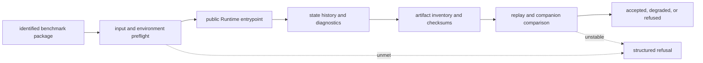

# Execution

Execution turns an identified public benchmark package into a run bundle that
can be rerun, compared, refused, and inspected without private operational
knowledge.

`bijux-proteomics-runtime` owns run-mode declaration, preflight, execution,
state history, replay, rerun comparison, artifact integrity, and runtime
refusal. A CLI transcript is one view of that evidence, not the execution
contract itself.

## What Execution Means Here

Execution evidence is narrower than scientific truth and stronger than a
convenient demo:

- it proves what can be rerun or replayed from the current public package set
- it proves which artifacts, checks, and refusal boundaries still survive
  without private maintainer glue
- it does not by itself widen scientific meaning, recommendation posture, or
  lab-worth claims that belong to other owners

## Current Runtime Ceiling By Family

| family | current runtime lane | what the runtime route proves | current runtime limiter |
| --- | --- | --- | --- |
| `dda` | `import_only` | downstream replay and review remain real and auditable | full in-repo live-engine parity is still not the flagship route |
| `dia` | `raw_executable` | public rerun, replay, and challenge routes are real | runtime proof still narrows under library and consequence limits |
| `lfq` | `raw_executable` | public rerun and comparability routes are real | execution strength does not erase missingness and cohort-transfer limits |
| `multiplex` | `raw_executable` | runtime substance is real and reviewable | outsider-facing trust still collapses under the stress packet |
| `ptm` | `raw_executable` | localization and rerun evidence survive public replay | consequence confidence remains narrower than execution strength |
| `targeted` | `raw_executable` | public rerun and artifact verification are real | calibration and interference limits still narrow the broader sentence |

## Runtime Evidence Flow

Every arrow has a durable record. A command transcript without input identity
cannot establish which benchmark ran. Output files without state history and
an artifact inventory cannot establish a run bundle. Similar values without a
declared comparison policy cannot establish replay or parity.

| Runtime disposition | Required record | Meaning |
| --- | --- | --- |
| accepted | request, environment, state history, complete artifact inventory, checks, comparison verdict | the declared runtime lane completed and met its runtime contract |
| degraded | completed output plus named instability, missing capability, or permitted narrowing | the lane produced reviewable evidence with a reduced runtime claim |
| refused | failed prerequisite or invariant, reason code, retained partial evidence, next admissible route | the requested execution claim is unavailable |

An accepted runtime disposition cannot promote scientific or experimental
authority. A refusal can still be a complete and trustworthy runtime result.

## Concrete Runtime Proof Surfaces

| runtime surface | current substance | why outsiders should care |
| --- | --- | --- |
| API and entrypoints | CLI, HTTP, and package-driven operator routes | reruns do not require private maintainer entrypoints |
| execution engine | orchestrated execution, replay, and evaluation control | the run path is inspectable instead of ad hoc |
| providers | builtin, local, and remote provider layers | execution realism is bounded explicitly |
| artifacts and checkpoints | run bundles, checkpoints, and stability classes | rerun claims can be checked after the run |
| state, resume, and rehydrate | persistent execution state and reopening routes | operators can prove what was resumed or rebuilt |
| diff and comparability surfaces | run comparison and replay challenges | "same result" becomes a tested question instead of a verbal claim |

## What A Successful Rerun Should Prove

- which public package pair was actually reopened
- which run mode was used and why that mode is still the strongest honest lane
- which artifacts, checkpoints, and verification records were emitted
- which replay or invalidation challenge the lane still survives
- which stronger sentence still remains blocked even after the rerun works

## Choose By Review Question

| Question | Route | Review closes when |
| --- | --- | --- |
| How do I reopen one family? | [Operator rerun journey](operator-rerun-journey.md) | package identity, environment, mode, command, outputs, and comparison are recorded |
| Which public package starts the rerun? | [Benchmark rerun kits](benchmark-rerun-kits.md) | primary and companion package roles and checksums are explicit |
| Which artifacts must a run emit? | [Black-box run verification](black-box-run-verification.md) | required, optional, absent, and invalid artifacts are classified |
| Which replay pressure must the lane survive? | [Runtime replay challenges](runtime-replay-challenges.md) | invalidation, resume, clean-environment, and failure-replay verdicts are visible |
| When must runtime stop? | [Runtime rerun refusals](runtime-rerun-refusals.md) | the failed condition and next admissible evidence route are named |

## What Execution Still Does Not Prove

- scientific truth independent of benchmark and knowledge owners
- stronger recommendation posture independent of intelligence review
- downstream assay worth independent of lab consequence
- vendor-parity or universal production readiness just because one rerun lane
  is reproducible

## Adjacent Authority

- [Benchmark assets](../04-bijux-proteomics-core/foundation/benchmark-assets.md)
  govern whether the public evidence root is adequate.
- [Workflow families](../01-bijux-proteomics/foundation/workflow-families.md)
  govern which family-level scientific sentence survives.
- [Decision support](../01-bijux-proteomics/foundation/decision-support.md)
  governs whether contradiction or consequence burden narrows the action.

## Interpretation Boundaries

- a raw-executable lane is stronger than an import-only lane, but neither lane
  automatically widens scientific trust on its own
- a stable run bundle is necessary for outsider review, but it is not the same
  thing as broader biological truth
- a successful local rerun does not erase benchmark incompleteness,
  grounding pressure, or downstream assay burden
- runtime refusal is part of runtime honesty, not a sign that the package has
  become weaker or less useful

## Boundary

Runtime evidence settles how an identified lane executed, what it emitted, and
whether it survived the declared replay pressure. Benchmark authenticity,
scientific acceptance, recommendation authority, and laboratory meaning remain
separate contracts.
